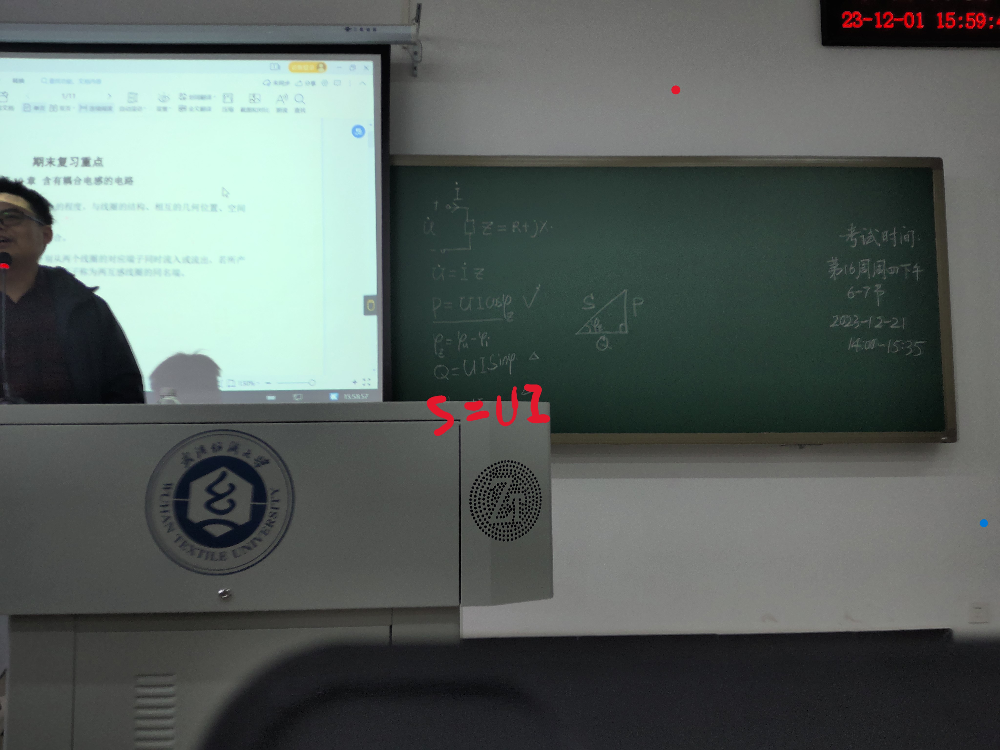
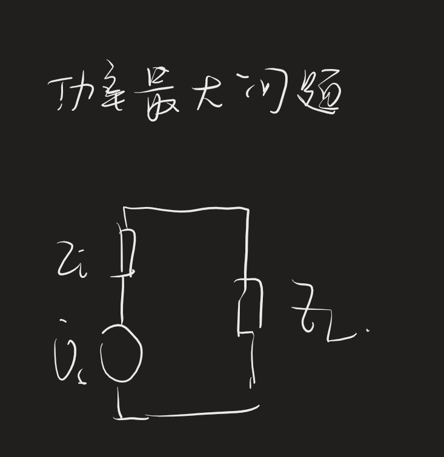

D:\MateBookE文件\笔记\Circuit_analysis\第16章_二端口网络\16-3二端口等效电路.md

## 第九章

## 1 重点章节

14章
16章

1 50分计算（7个）
2 50分填空

原函数，像函数

<!-- todo -->

二端口写T参数，Y参数矩阵
T型号Pi型等效电路

# 明天需要完成的任务

- 明天的任务 
  1. [ ] 下载群复习资料
  2. [ ] 整理复习顺序
  3. [ ] 打印复习资料

