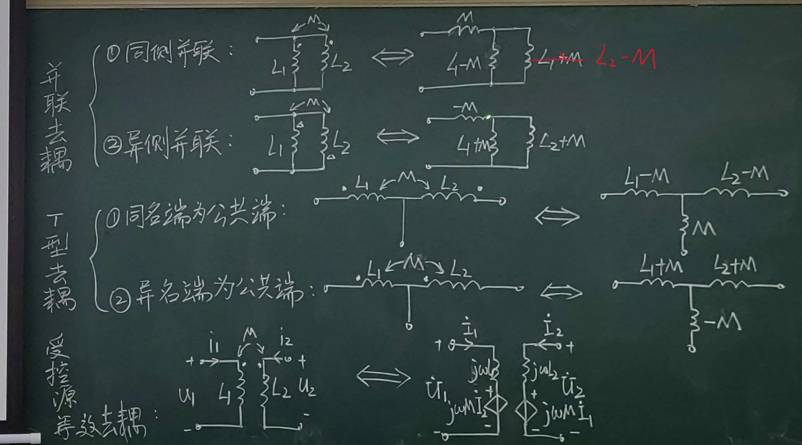

# 课程结构

- 耦合电感串并联等效
  - [耦合电感串联](#耦合电感串联)
    - 顺接
    - 反接
    - [等效计算](#耦合串联的等效计算)
  - [耦合电感并联](#耦合电感并联)
    - 同侧
    - 异侧
    - [等效计算](#耦合电感并联等效计算)
- [去耦等效](#去耦等效)
  - 并联去耦
    - 同侧
    - 反侧
- 互感系数的测量

# 10.2耦合电感的电路计算

## 串并联等效

### 耦合电感串联

#### 顺接

#### 反接

线圈含有阻值所以电路需要变为电阻和线圈串联
同名端都进电流则称为顺接，反则为反接

##### 直流

##### 正弦(反接)

#### 耦合串联的等效计算

- <mark>等效电阻：$R_{eq}=R_1 +R_2$
- <mark>等效电感：$L_{eq}=L_1+L_2\pm 2M$
- <mark>等效阻抗：$Z_{eq}=Z_1+Z_2=(R_1+R_2)+j\omega(L_1+L_2\pm 2M)$

##### 全耦合

$k=\frac{M}{\sqrt{L_1L_2}}$当K=1的时候我们认为时全耦合

$M=\sqrt{L_1L_2}$

### 耦合电感并联

#### 同侧并联

##### 理想状态（无电阻）

##### 正弦电路

#### 异侧并联

##### 理想状态（无电阻）

##### 正弦电路

#### 耦合电感并联等效计算

- 等效电感$$L_{eq}=\frac{L_1L_2-M^2}{L_1+L_2\pm 2M}$$

## 去耦等效
:poop:

- 并联去耦
  - 同侧并联
  - 异侧并联
- T型去耦
  - 同名端为公共端
  - 异名端为公共端
- 受控源电路（也可以使用T型等效解决）

### 例题

## 带有互感电路的计算
:poop:
1. 计算带上互感电压
2. 去耦合之后再计算

### 1.例题

### 2.例题

使用去耦等效

## 互感系数的测量
根据串联电感的等效我们发现顺接和反接两次接法可以计算出互感系数
因此得出了一个互感系数的测量方法及其公式

$$M= \frac{L_{顺接}-L_{反接}}{4}$$