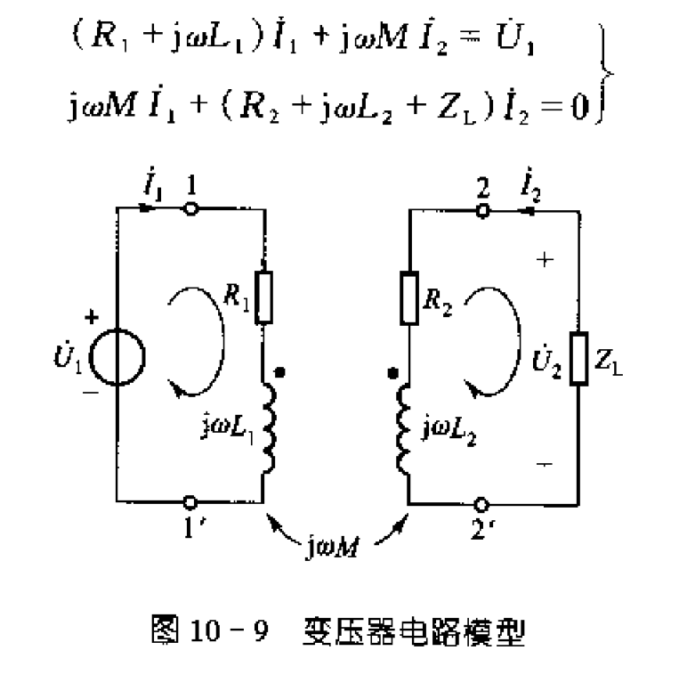
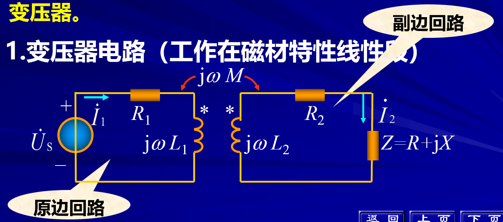
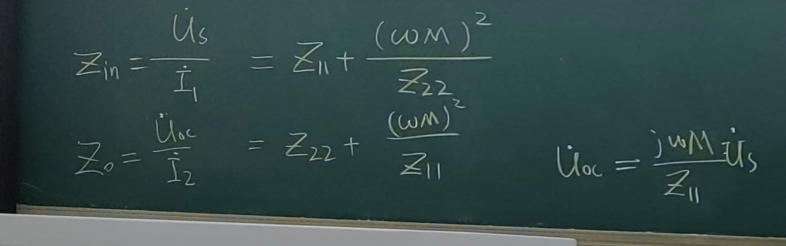
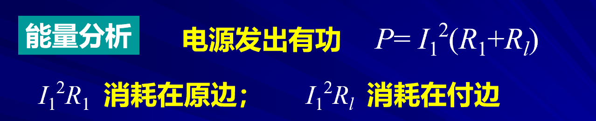
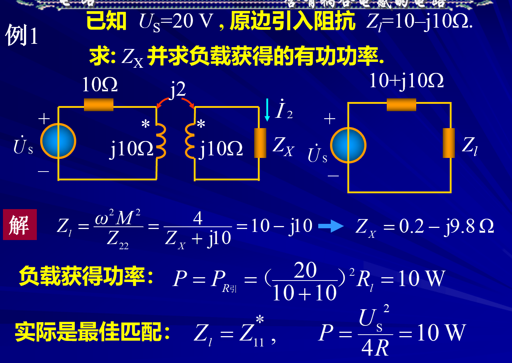
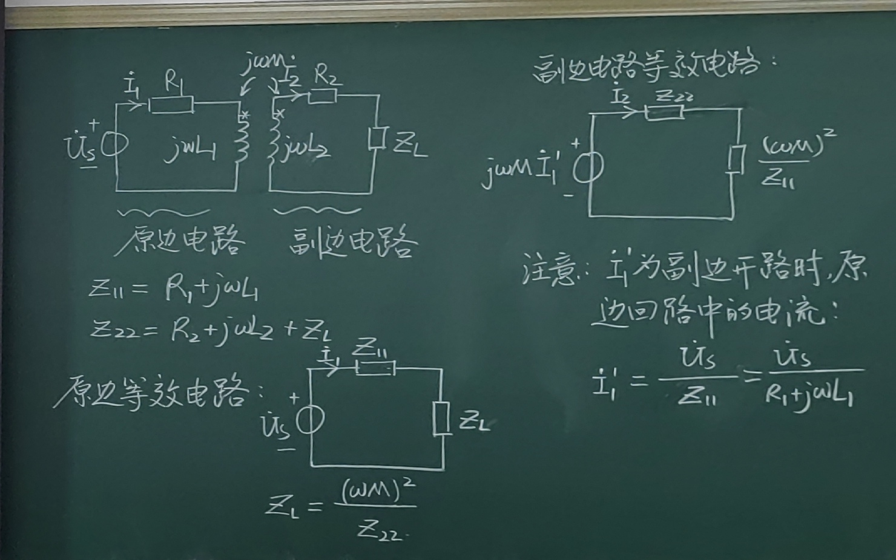

# 变压器

- 功能
  - 变电压
  - 变电流
  - 阻抗匹配

## 1 变压器电路

定义 $Z_{11}$为原边回路的总阻抗
$Z_{22}$为副边贿赂的总阻抗
:poop::poop::poop::poop::poop::poop::poop::poop::poop::poop::poop::poop::poop::poop:
输入阻抗$$Z_{in}=\frac{U_S}{I_S}$$
输出阻抗
**显然输入阻抗和输出阻抗可以将副边回路等效为一个阻抗**
### 1-1 分析方法

- 方程解析法 
- 等效电路分析法(等效是对外而言)
  - 

### 1-2 功率问题

### 1-3 例题

## 2-1 等效分析法
