# 三相电路

<!-- @import "[TOC]" {cmd="toc" depthFrom=1 depthTo=6 orderedList=false} -->

<!-- code_chunk_output -->

- [三相电路](#三相电路)
  - [1 三项电的产生](#1-三项电的产生)
    - [三项电源的相序](#三项电源的相序)
  - [2 三相电路的连接方式](#2-三相电路的连接方式)
    - [1星形连接（Y型连接）](#1星形连接y型连接)
    - [2三角形联接](#2三角形联接)
  - [三项电路的负载及其连接](#三项电路的负载及其连接)
  - [3 三项电路](#3-三项电路)

<!-- /code_chunk_output -->
---

- 三相电路的特殊性
  1. 特殊的电源
  2. 特殊的负载
  3. 特殊的链接
  4. 特殊的求解方式:star:

---

## 1 三项电的产生

三个绕组A:link:X，Y:link:B，C:link:Z
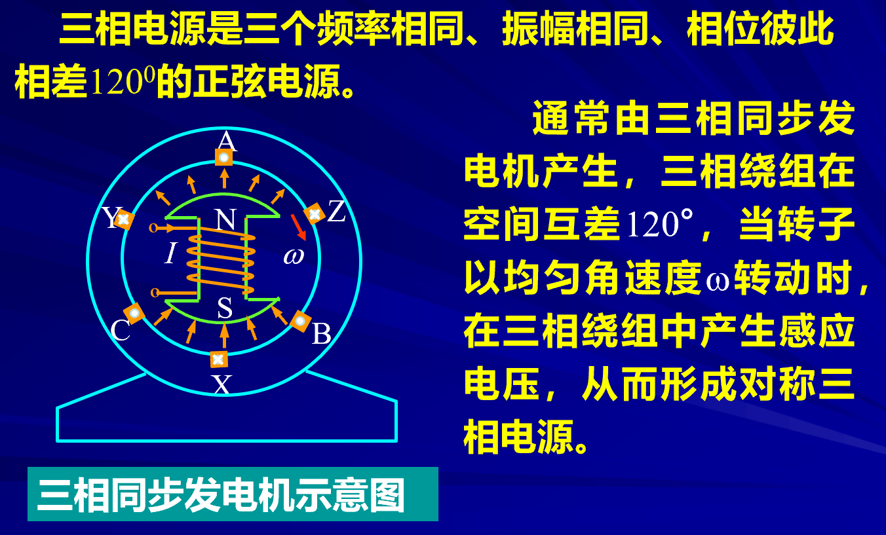
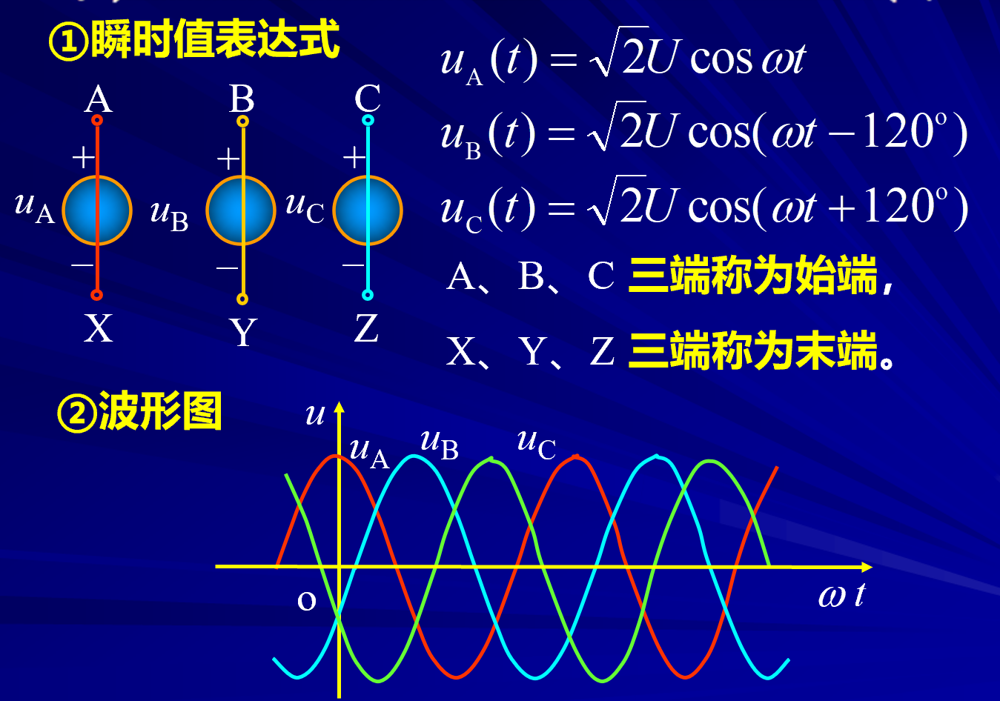
三项电动势
$$\begin{aligned}u_\mathrm{A}(t)&=\sqrt{2}U\cos\omega t\\u_\mathrm{B}(t)&=\sqrt{2}U\cos(\omega t-120^\circ)\\u_\mathrm{C}(t)&=\sqrt{2}U\cos(\omega t+120^\circ)\end{aligned}$$
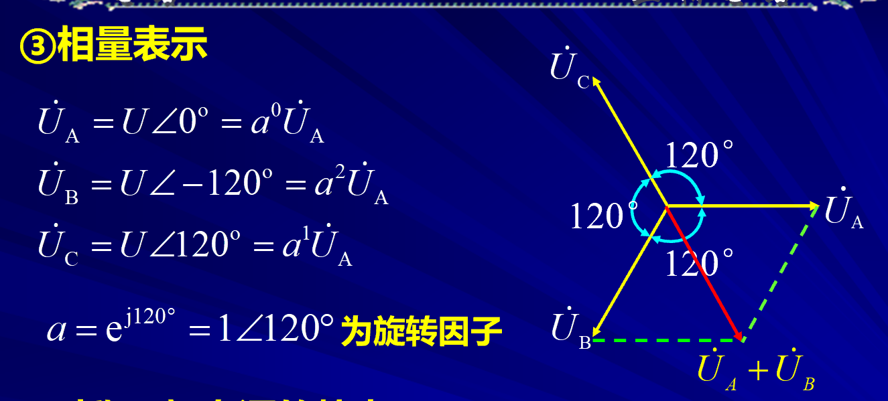
**对称的三相电路关系**
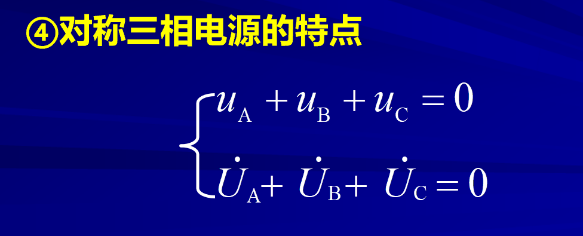  

### 三项电源的相序

三角形在三位空间显然只有两种顺序。
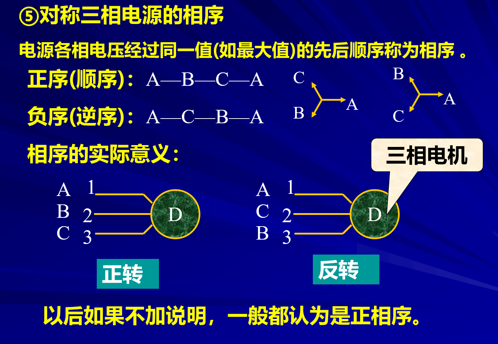、

## 2 三相电路的连接方式

1. 星形连接（Y型联接）
2. 三角形联接

### 1星形连接（Y型连接）

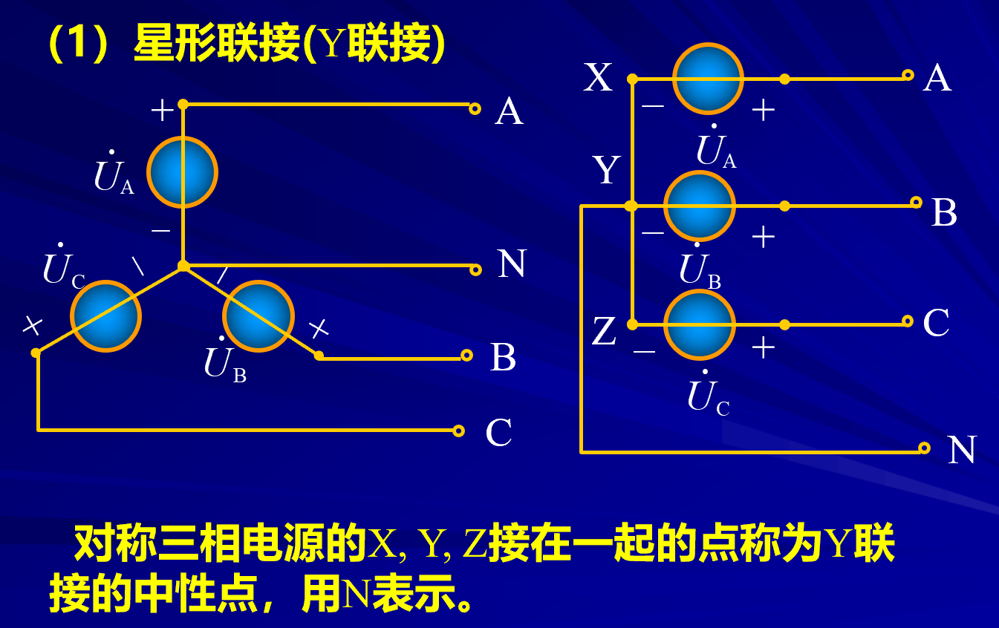

### 2三角形联接

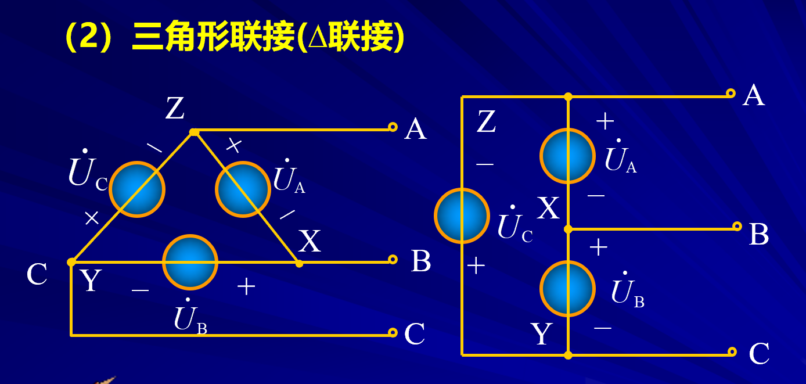

## 三项电路的负载及其连接

1. Y型联接
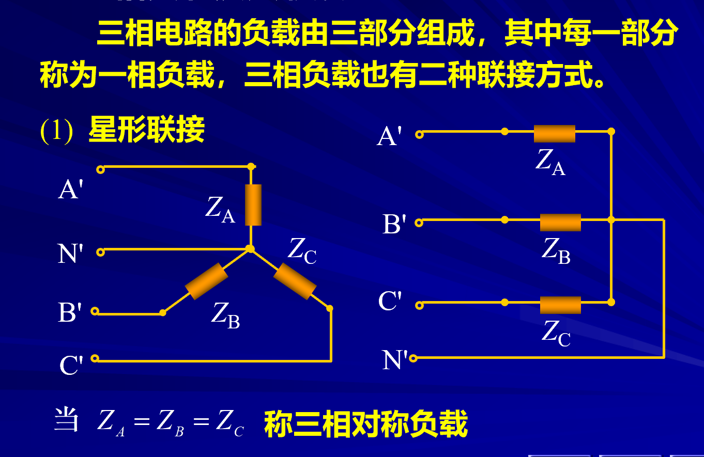
2. 三角形联接
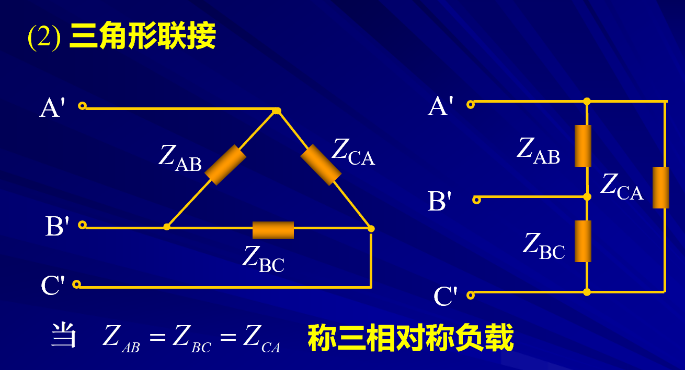

## 3 三项电路

由于电源有两种，负载有两种联接方式，所以三相电路有四种联接方式。
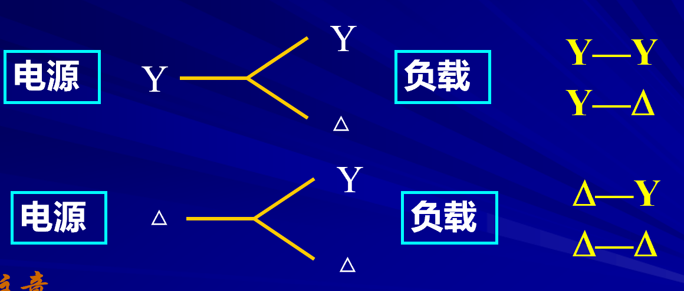
由于Y&$\Delta$可以相互转换，所以这四种最终可以转化成一种求解。重点掌握$Y-Y$型电路。
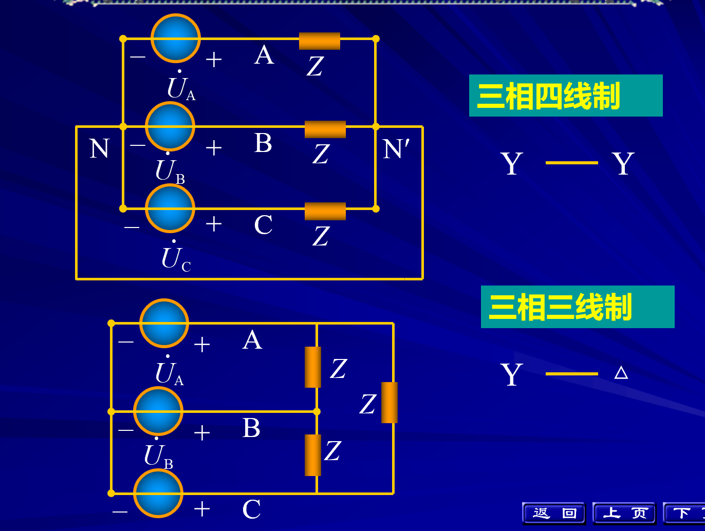