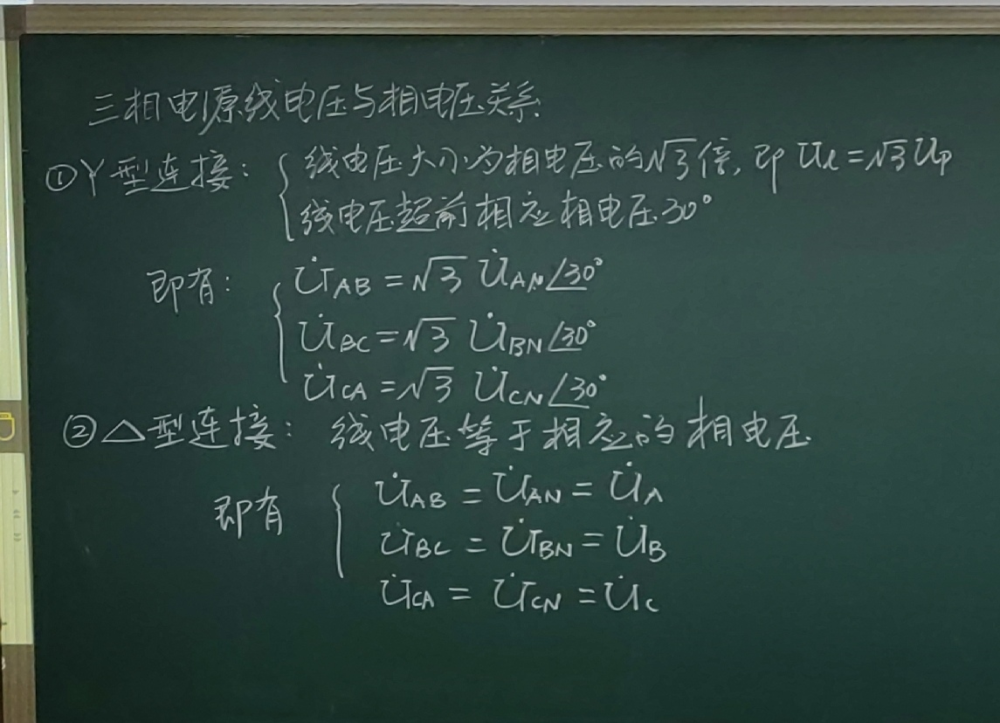
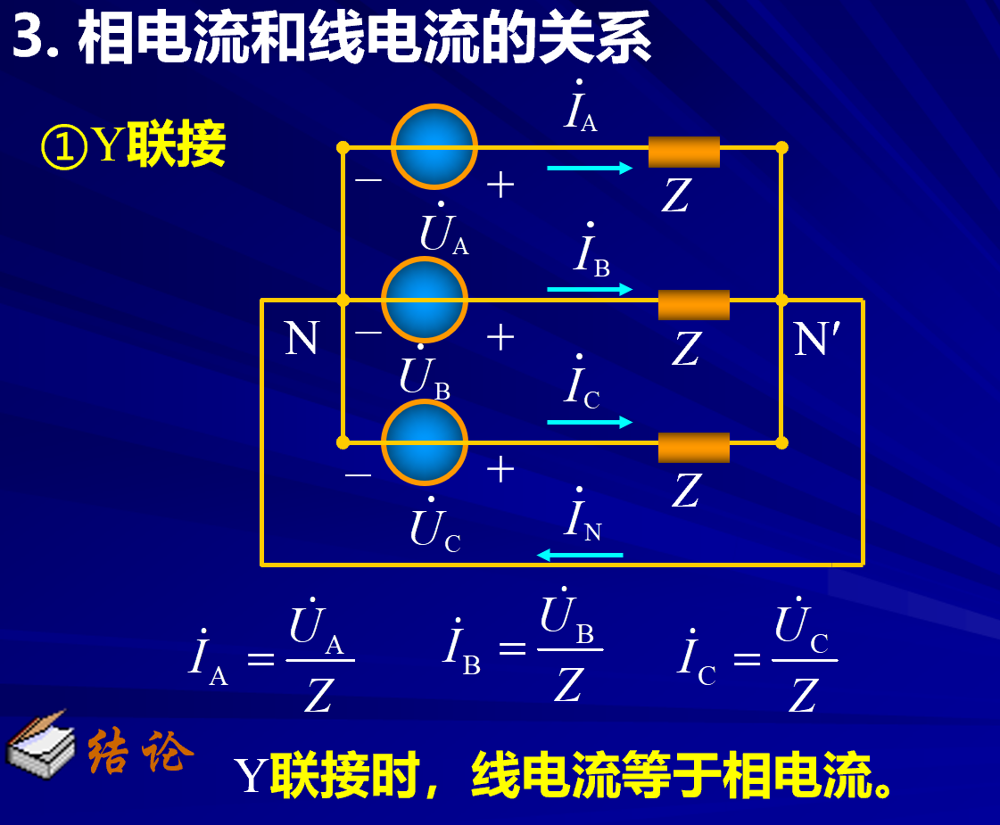
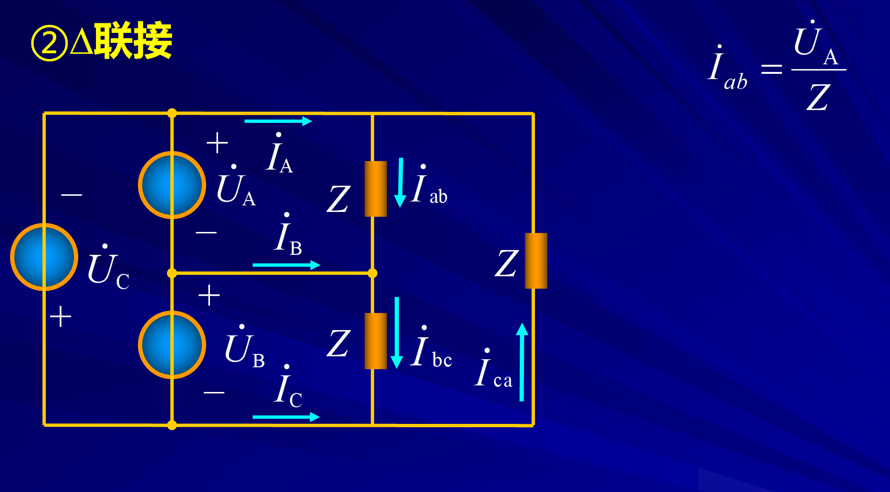
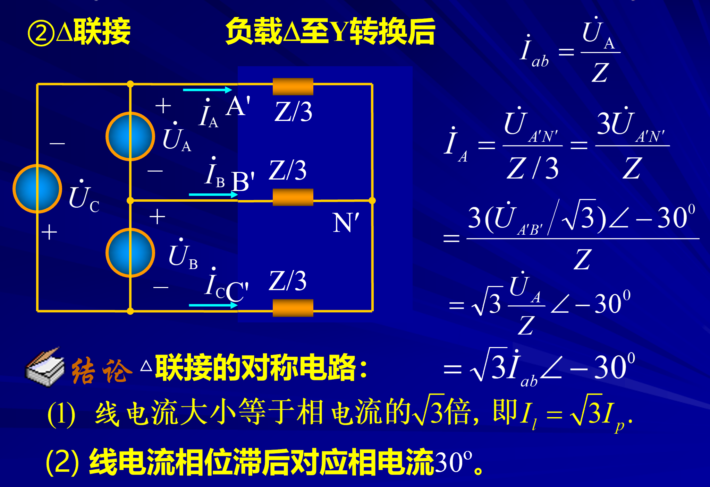

# 三项电路电流电压关系

<!-- @import "[TOC]" {cmd="toc" depthFrom=1 depthTo=6 orderedList=false} -->

<!-- code_chunk_output -->

- [三项电路电流电压关系](#三项电路电流电压关系)
  - [名词介绍](#名词介绍)
  - [1 相电压和线电压的关系](#1-相电压和线电压的关系)
    - [1-1 Y型联接](#1-1-y型联接)
    - [1-2 $\Delta$联接](#1-2-delta联接)
  - [2 相电流和线电流的关系](#2-相电流和线电流的关系)
    - [2-1 Y型联接](#2-1-y型联接)
    - [2-2$\Delta$型联接](#2-2delta型联接)

<!-- /code_chunk_output -->

---

## 名词介绍

**中性线：零线（地线）**

负载也有相电压（负载两端的电压）

- 负载的相电压和线电压关系
  - Y型联接      不相等
  - $\Delta$联接 相等
- 负载的线电流和相电流
  - Y型联接       相等
  - $\Delta$联接  不相等

## 1 相电压和线电压的关系
 
### 1-1 Y型联接  

1. 线电压是相电压的$\sqrt{3}$倍
2. 线电压超前相电压$30^\circ$

### 1-2 $\Delta$联接

## 2 相电流和线电流的关系

讨论电流的时候电路一定是一个完整的电路

### 2-1 Y型联接

### 2-2$\Delta$型联接

经过**电阻的等效变化**

