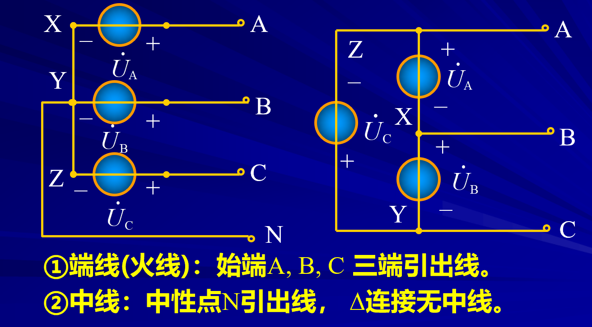
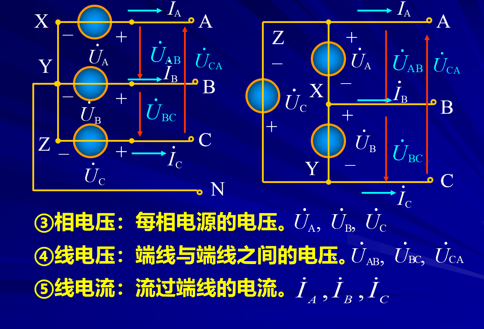
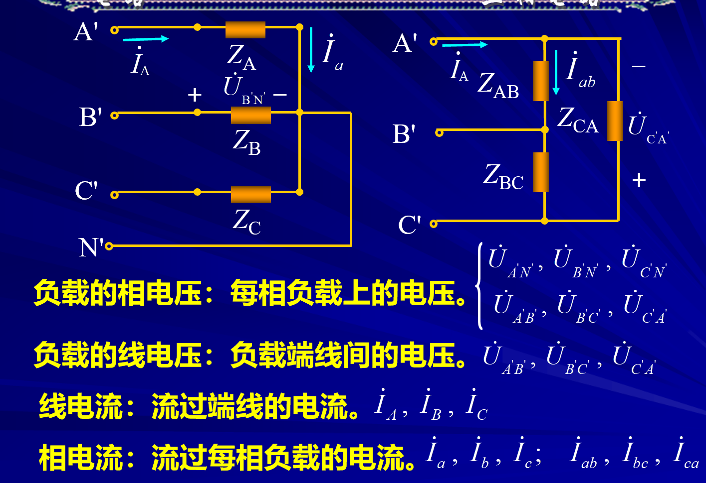
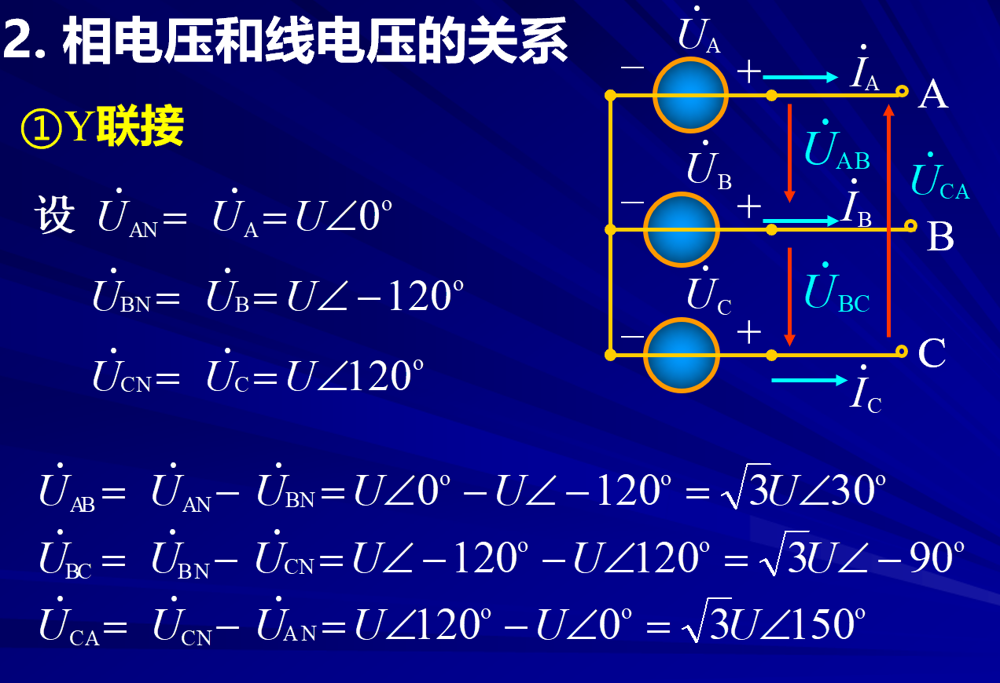
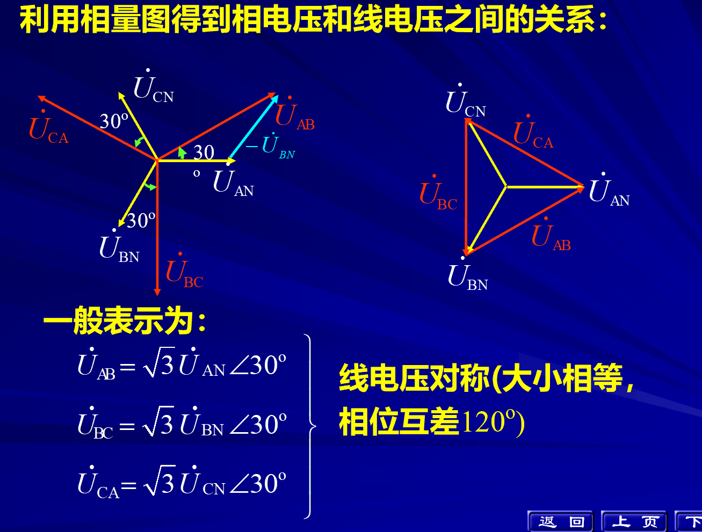
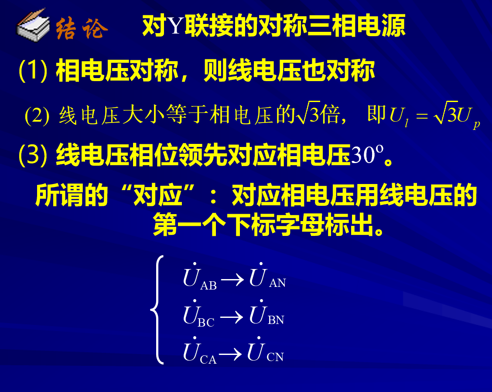
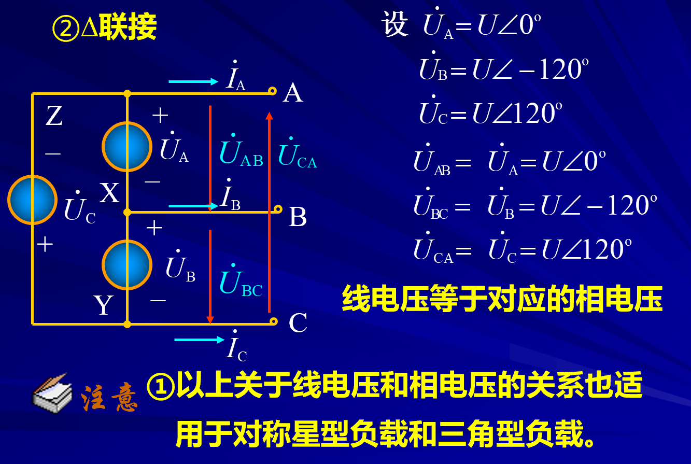
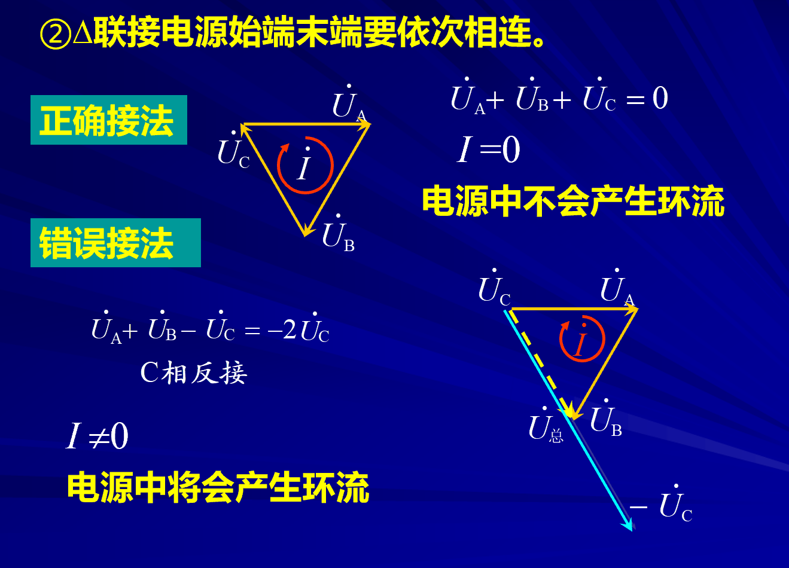

# 三项电路电流电压关系

## 名词介绍

**中性线：零线（地线）**

负载也有相电压（负载两端的电压）

- 负载的相电压和线电压关系
  - Y型联接      不相等
  - $\Delta$联接 相等
- 负载的线电流和相电流
  - Y型联接       相等
  - $\Delta$联接  不相等

## 相电压和线电压的关系
 
### 1 Y型联接  

1. 线电压是相电压的$\sqrt{3}$倍
2. 线电压超前相电压$30^\circ$

### 2 $\Delta$联接

