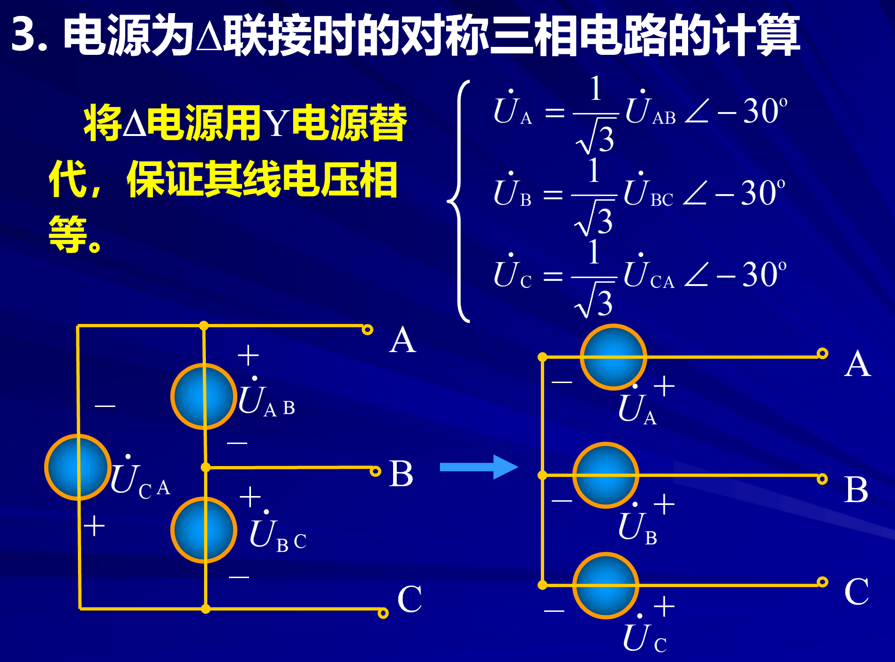

# 对称的三项电路的计算

我们只对两种电路进行分析

1. Y-Y型电路（三相三线制，由于对称吧N-N'的线省略，这条线没有电流）
2. Y-$\Delta$联接

## 1 Y-Y型电路

根据计算发现N-N'的电压为0所以N-N'之间不会有电流流过。
我们可以在单项的电路里面去求解

根据**对称性**我们只需要计算单项的电流

结论

## 2 Y-$\Delta$联接

## 3 三项电源的等效计算

综合方法

