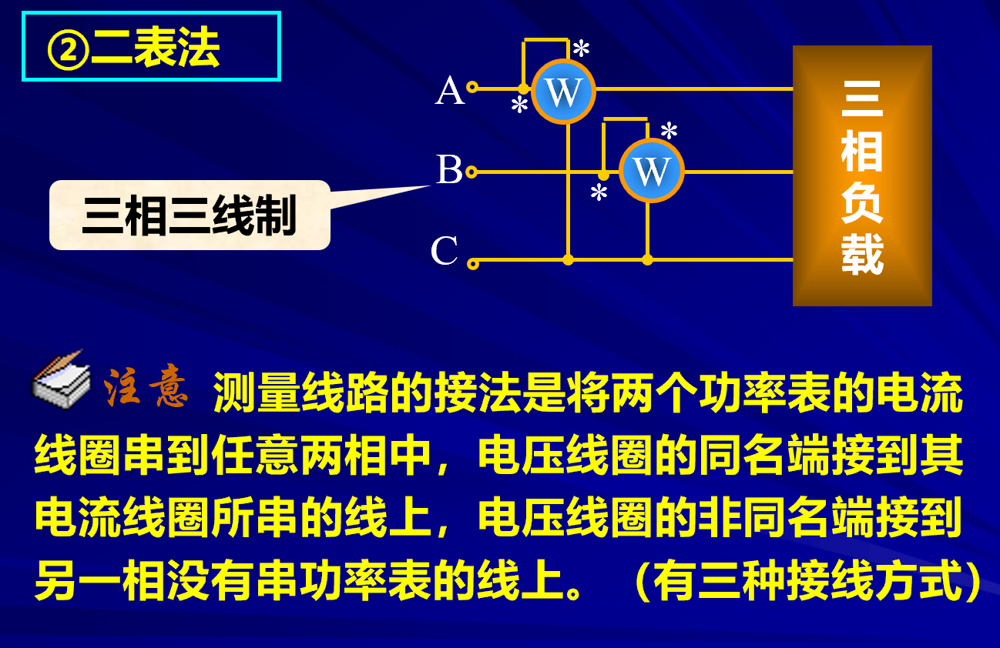

# 三相电路的功率

由于三相电路的对称性所以我们只需要计算一路的功率。

平均功率定义为相电流和相电压的乘积。

当我们具体考虑负载的联接方法时候：

因此我们得到了计算公式：
$$P=3U_PI_P\cos{\varphi}=\sqrt{3}U_lI_l\cos\varphi$$
$$\varphi = \arctan\frac{X}{R}$$
**$\varphi$也表示U和I的夹角**

三者构成功率三角形。
瞬时功率：

单项波动，三项恒定。

## 三项功率的测量

二表法：三相三线。

