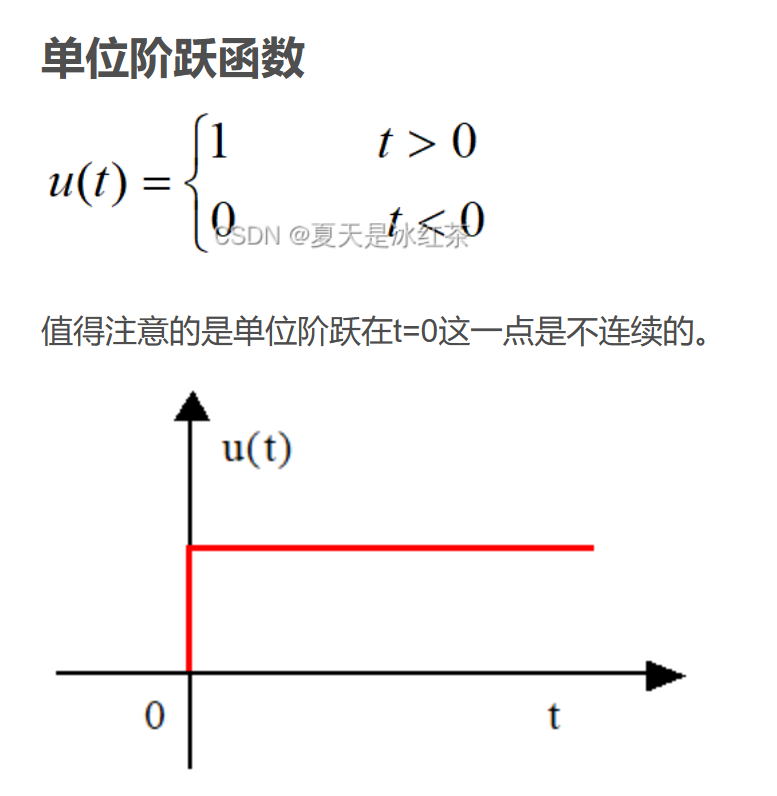
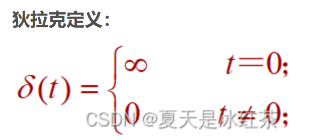
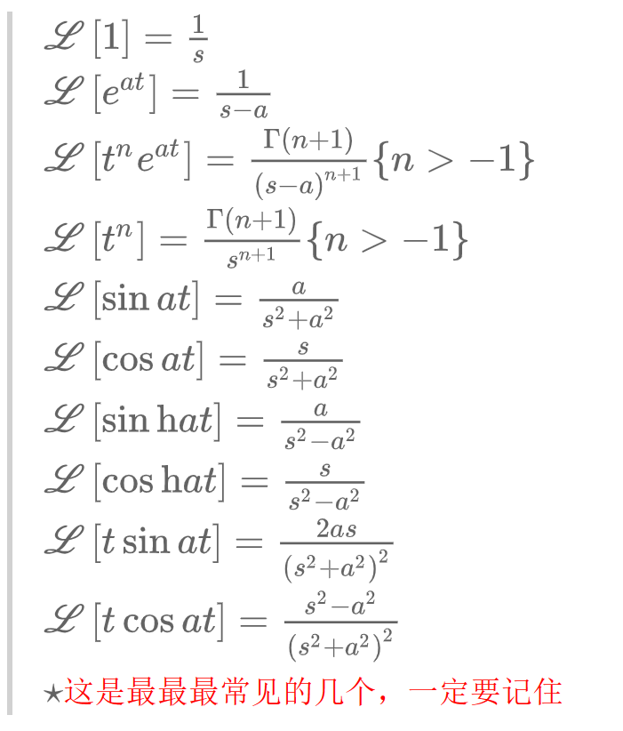
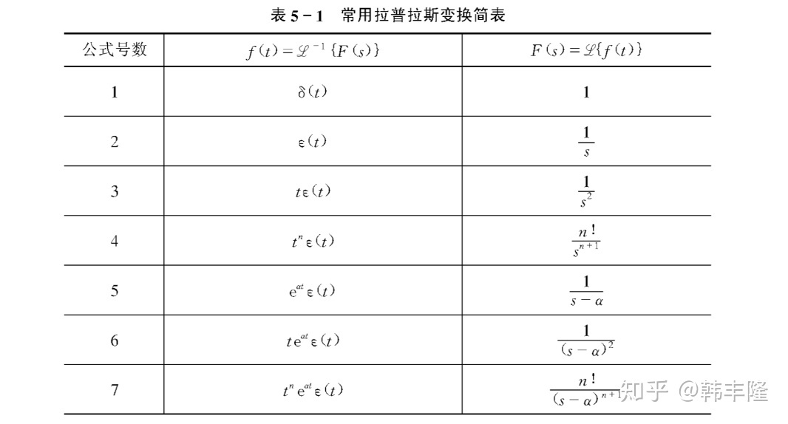

$$\mathscr{L}$$

## $${Laplace变换}$$

由于求解非线性文艺往往需要建立微分方程，而高阶的微分方程往往十分难以求解，所以我们不再在时域中进行求解，我们通过某种“变化”到复频域中转化成一种代数变化，最终再将结果变化回时域。

- [$${Laplace变换}$$](#laplace变换)
  - [1-1 关于“变换”](#1-1-关于变换)
  - [1-2 *Laplace*变化的定义](#1-2-laplace变化的定义)
  - [1-3 象函数/原函数](#1-3-象函数原函数)
  - [1-4 典型的Laplace变换](#1-4-典型的laplace变换)

---

### 1-1 关于“变换”
- “变换”
  - 对数变换
    - $A\times B=AB$ $\rightarrow$ $\lg A+\lg B = \lg AB$
  - 向量法
    - 正弦量$i_1+i_2 = i$ $\rightarrow$ $\overset{.}{I_1}+\overset{.}{I_2}=\overset{.}{I}$
  - 拉氏变换

### 1-2 *Laplace*变化的定义
$$\left.\left\{\begin{aligned}F(s)&=\int_{0_-}^{+\infty}f(t)e^{-st}\mathrm{d}t\\\\f(t)&=\frac1{2\pi j}\int_{c-j\infty}^{c+j\infty}F(s)e^{st}\mathrm{d}s\end{aligned}\right.\right.$$
我们简写为：
$$F(s) = \mathscr{L}[f(t)]$$
在此基础上我们定义了象函数
### 1-3 象函数/原函数
- 象函数 $I(s),U(s)$
- 原函数 $i(t),u(t)$

### 1-4 典型的Laplace变换
[^典型的Laplace变换]

1. 单位阶跃函数[^单位阶跃函数]
   - $\mathscr{L}[\varepsilon(t)]=\frac{1}{s}$
2. 单位冲激函数[^单位冲激函数]
   - $\mathscr{L}[\delta(t)]=1$
3. 指数函数
   - $\mathscr{L}[e^{at}]=\frac{1}{s-a}$
4. 正弦函数
   - $\mathscr{L}[\sin{(\omega t)}]=\mathscr{L}[\frac{e^{j\omega t}-e^{-j\omega t}}{2j}]=\frac{\omega}{s^2+\omega^{2}}$
5. 余弦函数
   - $\mathscr{L}[\cos(\omega t)] = \frac{s}{s^2+\omega^2}$
6. 指数函数
   - $\mathscr{L}[t^n]=\frac{n!}{S^{n+1}}$

单位阶跃函数和冲击函数的关系：
$\delta(t)=\frac{\mathrm{d}}{\mathrm{d}t}\varepsilon(t)$

[^单位阶跃函数]:

[^单位冲激函数]:

[^典型的Laplace变换]:

