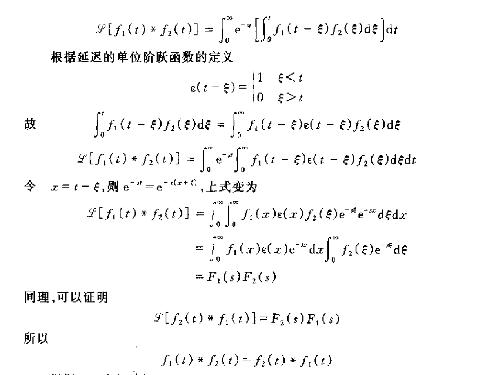

# Laplace变换的性质

- [Laplace变换的性质](#laplace变换的性质)
  - [1 线性性质](#1-线性性质)
  - [2 微分性质](#2-微分性质)
  - [3 积分性质](#3-积分性质)
  - [4 延迟性质](#4-延迟性质)
  - [5 Laplace卷积性质](#5-laplace卷积性质)
    - [5.1 卷积的定义](#51-卷积的定义)
    - [5.2 卷积的Laplace定理](#52-卷积的laplace定理)
---
## 1 线性性质  

**线性叠加**  
$\begin{aligned}
&\mathscr{L}[A_1f_1(t)+A_2f_2(t)]&& =A_1\mathscr{L}[f_1(t)]+A_2\mathscr{L}[f_2(t)]  \\
&&&=A_1F_1(s)+A_2F_2(s)
\end{aligned}$

## 2 微分性质

$$\begin{cases}
    \text{若：}\mathscr{L}[f(t)]=F(s)\\
    \text{则：}\mathscr{L}[f^{'}(t)]=sF(s)-f(0_{-})
\end{cases}$$
**使用了不定积分法$\int u\mathrm{d}\nu=u\nu-\int\nu\mathrm{d}u$**

## 3 积分性质

$$
\begin{cases}
\text{若：}\mathscr{L}[f(t)]={F}(s)\\
\text{则：}\mathscr{L}\left[\int_{0_{-}}^{t}f(\xi)\mathrm{d}\xi\right]=\frac{{F}(s)}s
\end{cases}
$$

借用了微分性质：$\left.\operatorname{\mathscr{L}}[f(t)]=\operatorname{\mathscr{L}}\left[\begin{array}{c}\frac{\mathrm{d}}{\mathrm{d}t}\int_{0^-}^tf(t)\mathrm{d}t\\\end{array}\right.\right]$

## 4 延迟性质  

$$\begin{cases}
    \text{若：}\mathscr{L}[f(t)]=F(s)\\
    \text{则：}\mathscr{L}[f(t-t_0)\varepsilon(t-t_0)]=e^{-st_0}F(s)
\end{cases}$$

$e^{st_0}$称为延迟因子

## 5 Laplace卷积性质

### 5.1 卷积的定义
$$f_1(t)*f_2(t)=\int_0^{t}f_1(t-\xi)f_2(\xi)\mathrm{d}\xi $$

### 5.2 卷积的Laplace定理
$$\begin{aligned}
\mathscr{L}[f_{1}(t)* f_{2}(t)]& ={\mathscr{L}}\left[\int_{0}^{t}f_{1}\left(t-\xi\right)f_{2}\left(\xi\right)\mathrm{d}\xi\right]  \\
&=F_{1}(s)F_{2}(s)
\end{aligned}$$
文末给出证明[^1]

[^1]: