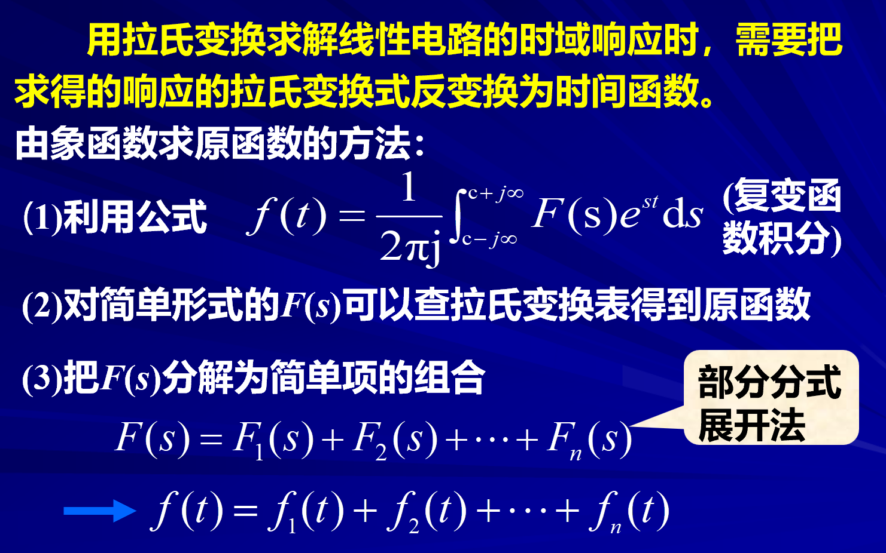
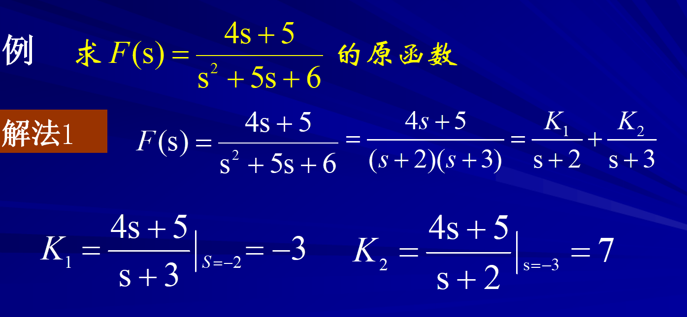
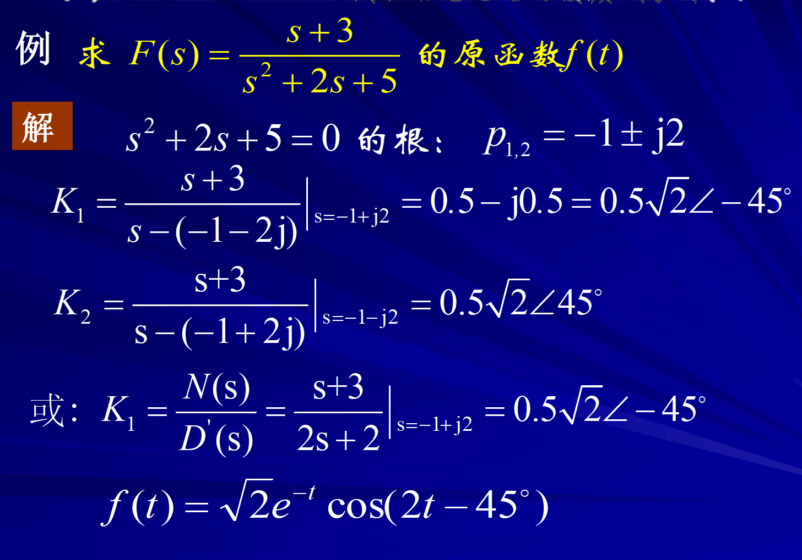

# 拉普拉斯反变化的部分分式展开

<!-- @import "[TOC]" {cmd="toc" depthFrom=1 depthTo=6 orderedList=false} -->

<!-- code_chunk_output -->

- [拉普拉斯反变化的部分分式展开](#拉普拉斯反变化的部分分式展开)
  - [1 总概](#1-总概)
  - [2 分式展开](#2-分式展开)
    - [2.1 单根](#21-单根)
      - [2.1.1 待定系数法](#211-待定系数法)
      - [2.1.2 极限法](#212-极限法)
    - [2.2 共轭复根](#22-共轭复根)
    - [2.3 重根$^*$](#23-重根)

<!-- /code_chunk_output -->

---

## 1 总概
$$\underset{F(s)}{象函数}\rightarrow\underset{f(t)}{原函数}$$

$$f(t)=\frac1{2\pi j}\int_{c-j\infty}^{c+j\infty}F(s)e^{st}\mathrm{d}s$$

方法
1. 拉氏逆变换公式法
2. 简单的$F(s)$可查表求$f(t)$
3. 将$F(s)$分解为简单项组合，再分别求出对应的原函数，再由线性叠加行求出$f(t)$

---
## 2 分式展开
我们可以把分式的象函数写成：
$$F(s)=\frac{N(s)}{D(s)}=\frac{a_{0}s^{m}+a_{1}s^{m-1}+\cdots+a_{n}}{b_{0}s^{n}+b_{1}s^{n-1}+\cdots+b_{n}}$$

首先对一个分式进行展开的时候我们需要将分式变成真分式：

$$F(s)=A+\frac{N_0(s)}{D(s)}$$

进行下一步展开时，我们需要找到分母根的情况，写成多项式的乘积形式才能展开，因此讨论根的情况显得很有意义，由于象函数是在复数域进行讨论因此我们的根分为以下情况：

1. 单根
2. 共轭复根
3. 重根

### 2.1 单根 

#### 2.1.1 待定系数法
如果$D(s)=0$有单根：$p_{1}\cdot p_{2}\cdot\cdots\cdot p_{n}$

$$F(s)=\frac{K_1}{s-p_1}+\frac{K_2}{s-p_2}+\cdots+\frac{K_n}{s-p_n}$$

$$(s-p_{1})F(s)=K_{1}+(s-p_{1})\left(\frac{K_{2}}{s-p_{2}}+\cdots+\frac{K_{x}}{s-p_{n}}\right)$$
$\text{令 }s=p_{1}$

$$K_{1}=\left[\left(s-p_{1}\right)F(s)\right]_{s=p_1}$$

$\text{同理可求得 }K_2,K_3,\cdots,K_n。$

$$K_i=F(s)(s-p_i)\bigg|_{s=p_i}\quad i=1,2,3\cdots\text{n}$$

==文末给出例题：==[^单根例题]
#### 2.1.2 极限法

$$
K_i = \lim_{{s\to p_i}}(s-p_i)F(s) = \lim_{{s\to p_i}}\frac{N(s)(s-p_i)}{D(s)} = \lim_{{s\to p_i}}\frac{N^{\prime}(s)(s-p_i)+N(s)}{D^{\prime}(s)}=\frac{N(p_i)}{D^{\prime}(p_i)}
$$

**综上所述我们得到了逆变换展开式：**
$$f(t)=\frac1{2\pi j}\int_{c-j\infty}^{c+j\infty}F(s)e^{st}\mathrm{d}s$$

$$f(t) = \mathscr{L}^{-1}[F(s)]=\sum_{i=1}^nK_i\mathrm{e}^{p_it}=\sum_{i=1}^n\frac{N(p_i)}{D^{\prime}(p_i)}\mathrm{e}^{p_it}$$

### 2.2 共轭复根

如果$D(s)=0$有共轭复根$p_{1}=\alpha+\mathrm{j}\omega,p_{2}=\alpha-\mathrm{j}\omega $

下面直接借用了上文的极限法结论：

$$K_1 = \left[\left.(s-\alpha-j\omega)F(s)\right.\right]_{s=\alpha+j\omega} = \left.\frac{N(s)}{D^{\prime}(s)}\right|_{s= \alpha+j\omega}$$

$$K_2 = \left[\left.(s-\alpha+j\omega)F(s)\right.\right]_{s=\alpha-j\omega} = \left.\frac{N(s)}{D^{\prime}(s)}\right|_{s= \alpha-j\omega}$$

由于$F(s)$是一个复数的映射，因此我们输入两个共轭复数得到的显然也是两个共轭复数，所以$K_1,K_2$都是复数：

$$K_1 = |K_1|e^{j\theta_1},K_2 = |K_1|e^{-j\theta_1}$$

$$\begin{aligned}
f\left(t\right)& =K_{1}e^{\left(\alpha+j\omega\right)t}+K_{2}e^{\left(\alpha-j\omega\right)t}  \\
&=|K_{1}|e^{j\theta_{1}}e^{(\alpha+j\omega)t}+|K_{1}|e^{-j\theta_{1}}e^{(\alpha-j\omega)t} \\
&=|K_{1}|e^{\alpha t}[e^{j(\omega t+\theta_{1})}+e^{-j(\omega t+\theta_{1})}] \\
&=2|K_{1}|e^{\alpha t}\cos\left(\omega t+\theta_{1}\right)
\end{aligned}$$
文末给出例题[^1]

### 2.3 重根$^*$ 

如果$D(s)=0$有多重根，即含有$(s-p_i)^n$的多项式。
我们以三重根为例子：

$$F(s)=\frac{K_{13}}{s-p_1}+\frac{K_{12}}{(s-p_1)^2}+\frac{K_{11}}{(s-p_1)^3}+\left(\frac{K_2}{s-p_2}+\cdots\right)$$[^2]

为了求$K_{11}， K_{12},\text{和 }K_{13}$：
$$(s-p_1)^3F(s)=(s-p_1)^2K_{13}+(s-p_1)K_{12}+K_{11}+(s-p_1)^3\left(\frac{K_2}{s-p_2}+\cdots\right)$$

$$K_{11}=(\begin{array}{cc}s-p_1\\\end{array})^3F(s)|_{s=p_1}$$
为了求$K_{12}$我们对两边求导:

$$\frac{\mathrm{d}}{\mathrm{d}s}[(s-p_1)^3F(s)]=2(s-p_1)K_{13}+K_{12}+\frac{\mathrm{d}}{\mathrm{d}s}[(s-p_1)^3\left(\frac{K_2}{s-p_2}+\cdots\right)]$$
所以：
$$K_{12}=\frac{\mathrm{d}}{ds}[\left(s-p_1\right)^3F(s)]_{s=p_1}$$
同样：
$$K_{13}=\frac12\frac{\mathrm{d}^2}{\mathrm{d}s^2}[(s-p_1)^3F(s)]_{s=p_1}$$

$$
\begin{align*}
K_{11} &= (s - p_1)^q F(s) \bigg|_{s=p_1} \\
K_{12} &= \frac{d}{ds}\left[(s - p_1)^q F(s)\right] \bigg|_{s=p_1} \\
K_{13} &= \frac{1}{2}\frac{d^2}{ds^2}\left[(s - p_1)^q F(s)\right]\bigg|_{s=p_1} \\
&\vdots \\
K_{1q} &= \left.\frac{1}{(q-1)!}\frac{d^{q-1}}{ds^{q-1}}\left[(s - p_1)^q F(s)\right]\right|_{s=p_1}
\end{align*}
$$

[^2]:**注意K的角标，双重角标表示重根**
[^单根例题]:
[^重根例题]: