# 运算电路  

<!-- @import "[TOC]" {cmd="toc" depthFrom=1 depthTo=6 orderedList=false} -->

<!-- code_chunk_output -->

- [运算电路](#运算电路)
  - [1 基尔霍夫定律的运算形式](#1-基尔霍夫定律的运算形式)
  - [2 电路元件的运算形式](#2-电路元件的运算形式)
    - [2.1 电阻的运算形式](#21-电阻的运算形式)
    - [2.2 电感的运算形式](#22-电感的运算形式)
    - [2.3 电容的运算形式](#23-电容的运算形式)
    - [2.4 耦合电感的运算形式](#24-耦合电感的运算形式)
    - [2.5 受控源的运算形式](#25-受控源的运算形式)
    - [2.6 RLC串联电路的运算形式](#26-rlc串联电路的运算形式)
  - [3 运算过程](#3-运算过程)

<!-- /code_chunk_output -->

---
总结[^总结]

- 分析对象：线性动态电路
- 分析方法：
  - 时域
    - 经典法：列出微分方程求解
    - 三要素法求解（向量域）
  - 复频域：运算电路法
- 思想：转化&化简

---

## 1 基尔霍夫定律的运算形式  

在时域中：
对于任意结点：$\Sigma i(t) = 0$
对于任意回路：$\Sigma u(t) = 0$

经过Laplace变换的线性叠加性质，我们的基尔霍夫定律依然适用并且形式不变：
$\Sigma I(s) = 0$
$\Sigma U(s) = 0$

## 2 电路元件的运算形式  

我们得到了基尔霍夫的运算形式，但是并不知道电路元件的变换形式，因此还需要对电路的Laplace变换进行讨论。

### 2.1 电阻的运算形式  

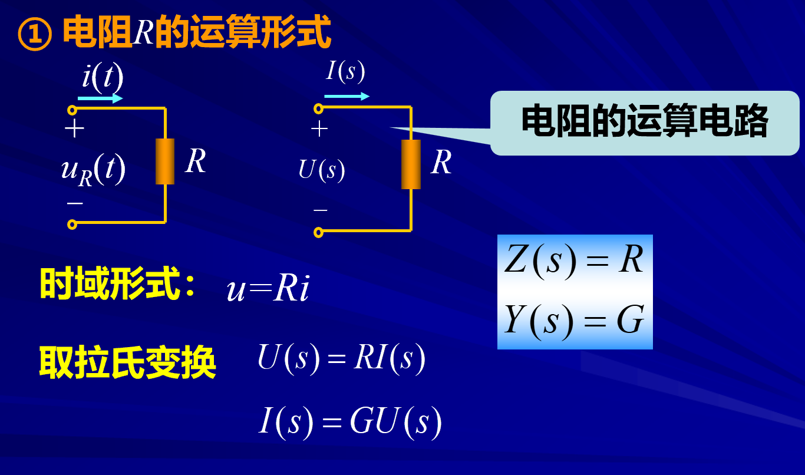
这是因为Laplace变换的线性性质，$R$可以提出去。
**结论：**  电阻的运算形式和时域相同

### 2.2 电感的运算形式  

时域形式：
$$u = L\frac{di}{dt}$$

复频域：
Laplace变换之后:
$$\mathscr{L}\left[u\left(t\right)\right]=\mathscr{L}\left[L\frac{\mathrm{d}i\left(t\right)}{\mathrm{d}t}\right]$$
根据微分性质：
$$U(s)=sLI(s)-Li(0_{-})$$
得到伏安特性，并且反推运算电路：
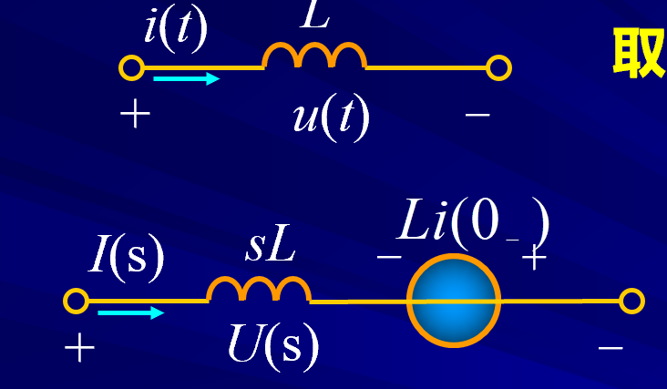

**结论：** 电感的运算电路相当于新的电感串联一个电压源。$SL$称为复阻抗。注意和复数于的复感抗$j\omega L$和复容抗$\frac{1}{j\omega C}$作出区分。
**注意电压源的方向相反！**

同样我们从戴维南等效原理和电流形式的变换可以得到另外一种等效形式：[^电流等效形式]

### 2.3 电容的运算形式  

时域形式：

$$i = C\frac{du}{dt}$$
$$u=u(0_-)+\frac1C\int_{0_-}^ti(\xi)\operatorname{d}\xi $$

复频域形式：
根据Laplace的积分性质

$$U(s)=\frac1{sC}I(s)+\frac{u(0_-)}s$$
$$I(s)=sCU(s)-Cu(0_-)$$

根据伏安特性得到运算电路：[^电流形式]

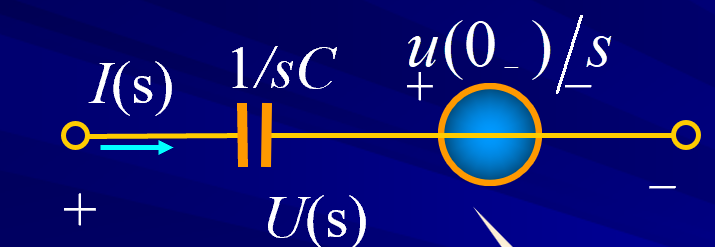

### 2.4 耦合电感的运算形式  

时域形式：

$$\begin{cases}
\begin{aligned}
u_1 &= L_1\dfrac{\mathrm{d}i_1}{\mathrm{d}t}+M\dfrac{\mathrm{d}i_2}{\mathrm{d}t}\\
u_2 &= L_2\dfrac{\mathrm{d}i_2}{\mathrm{d}t}+M\dfrac{\mathrm{d}i_1}{\mathrm{d}t}
\end{aligned}
\end{cases}
$$

复频域形式：

$$\begin{cases}U_1(s)=sL_1I_1(s)-L_1i_1(0_-)+sMI_2(s)-Mi_2(0_-)\\U_2(s)=sL_2I_2(s)-L_2i_2(0_-)+sMI_1(s)-Mi_1(0_-)\end{cases}$$

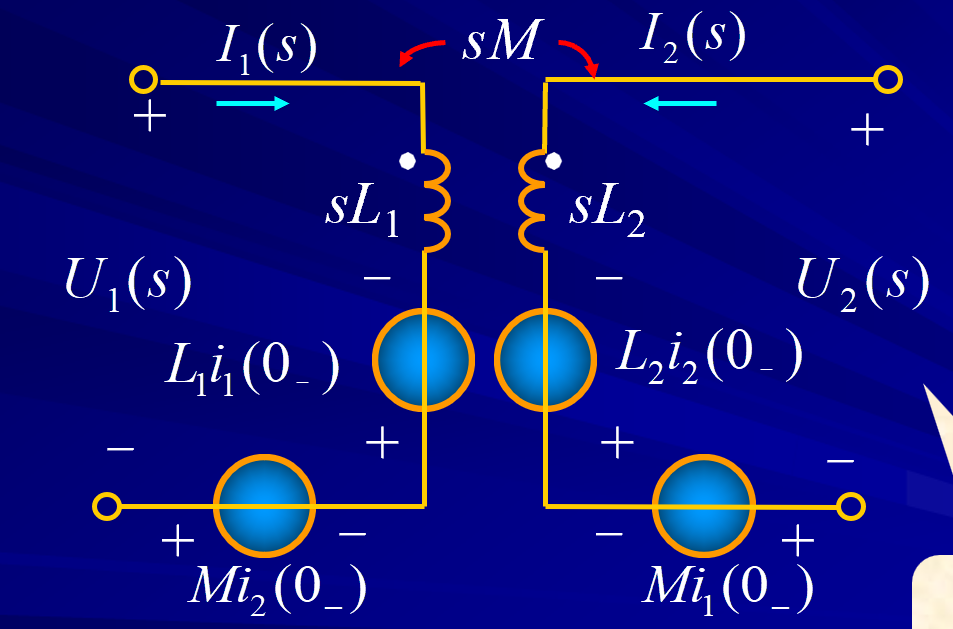

### 2.5 受控源的运算形式  

我们以电流源为例子：
时域形式：
$$i_1 = \frac{u_1}{R}$$
$$i_2 = \beta i_1$$
复频域形式： 
由于时域形式为线性形式，所以复频域的形式依然保持不变：
$$I_1(S) = \frac{u_1(s)}{R}$$

$$I_2(S) = \beta I_1(s)$$

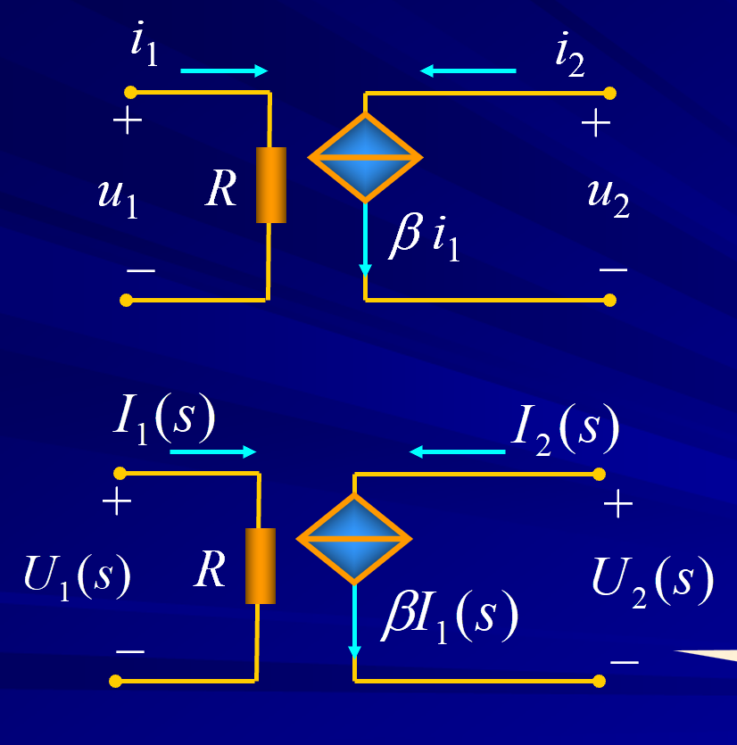

### 2.6 RLC串联电路的运算形式  

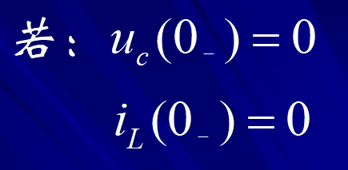
所以附加电源等于0

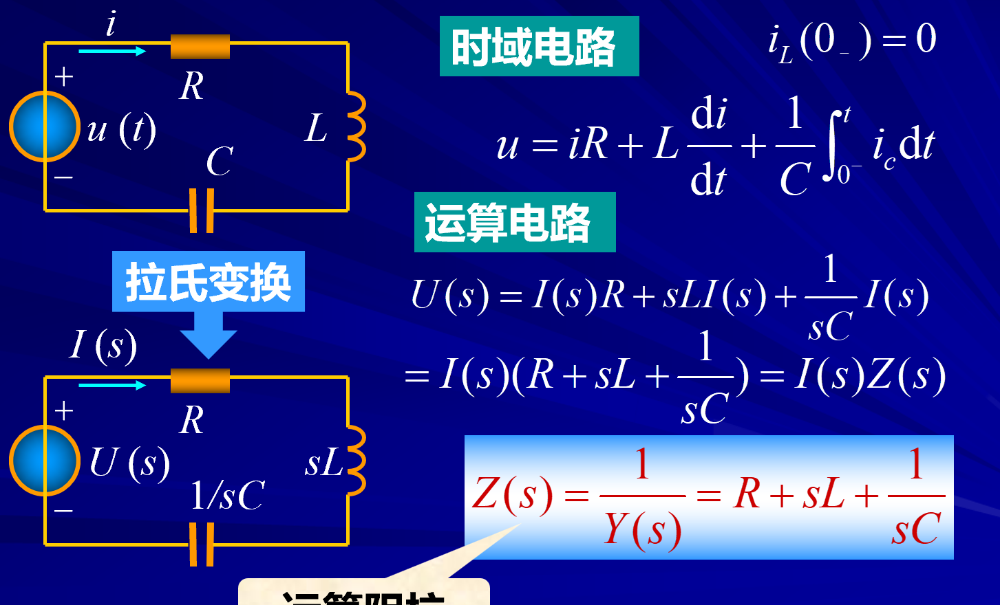

如果初始条件不为0
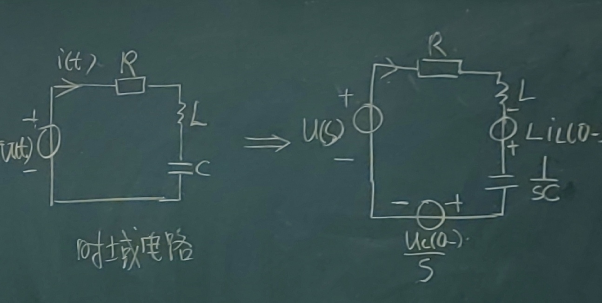

## 3 运算过程

1. 画出电路的运算形式
2. 根据基尔霍夫的运算形式列出复频域方程

<!-- ==END==  -->

[^电流等效形式]:$$I(s)=\frac{U(s)}{sL}+\frac{i(0_-)}s$$
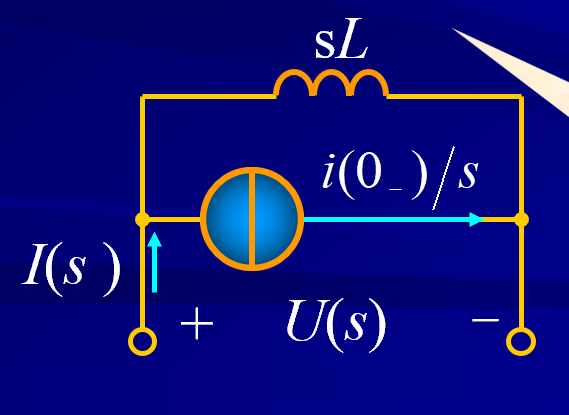

[^电流形式]: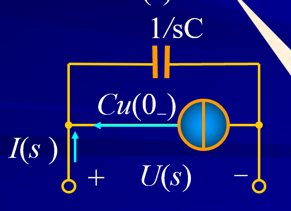

[^总结]: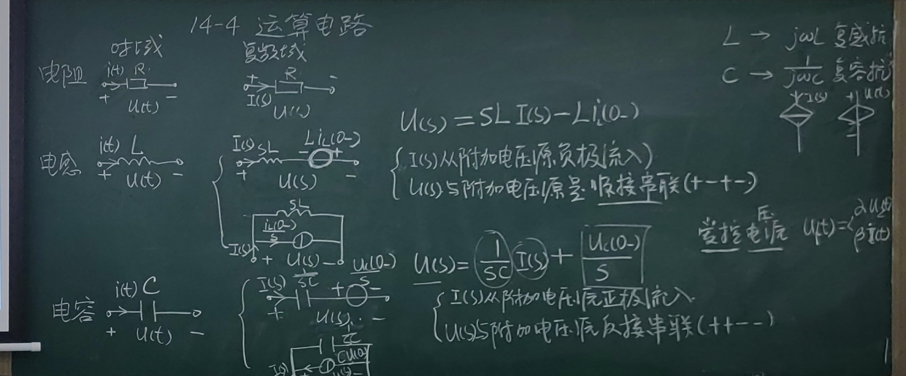
