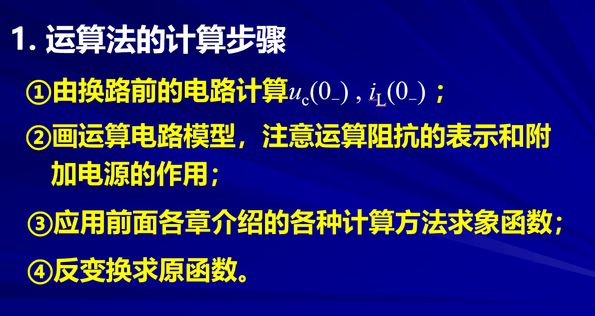

# 运算电压法  

<!-- @import "[TOC]" {cmd="toc" depthFrom=1 depthTo=6 orderedList=false} -->

<!-- code_chunk_output -->

- [运算电压法](#运算电压法)
  - [1 运算电路法计算步骤](#1-运算电路法计算步骤)
  - [2 例题](#2-例题)
    - [2.1](#21)
    - [2.2](#22)
    - [2.3](#23)

<!-- /code_chunk_output -->

---

## 1 运算电路法计算步骤  

1. 求动态原件（电容/电感）的初始值 
2. 画出运算电路（14-4运算电路）
3. 利用基尔霍夫等电路分析方法求出象函数
4. 反变换求原函数（14-3）

## 2 例题  

### 2.1 

==**注意换路定则需要有条件，不一定成立**==

电压产生突变。
**运算电路的时候解除的解可以从0_时刻开始，我们求出的值可能存在脉冲量，这和三要素法求得的结果不相同**

当$\delta(0)= 0$的时候是一个冲激函数，此时换路定则不适用。

### 2.2  

1. $i_s = \varepsilon(t)$

1.1 初始值  $u_c(0_{-})=0$
1.2 画出运算电路  
$\mathscr{L}[\varepsilon(t)] = \frac{1}{s}$

1.3 列方程 

### 2.3  

==**注意换路定则需要有条件，不一定成立**==

电压产生突变。
**运算电路的时候解除的解可以从0_时刻开始，我们求出的值可能存在脉冲量，这和三要素法求得的结果不相同**

当$\delta(0)= 0$的时候是一个冲激函数，此时换路定则不适用。

**拉氏变换的初始值是$0_{-}$而三要素法初始值为$0_{+}$**
