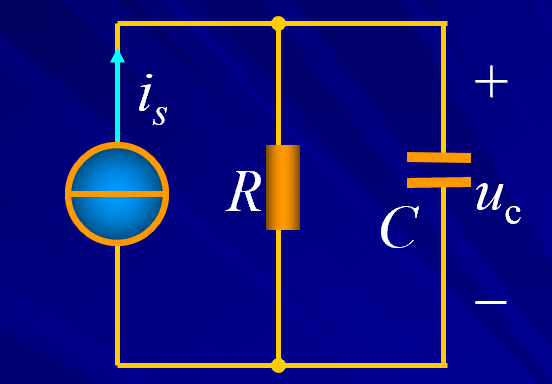
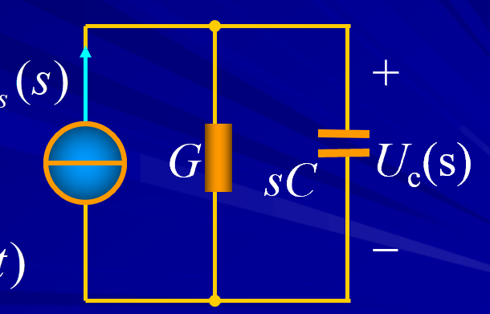
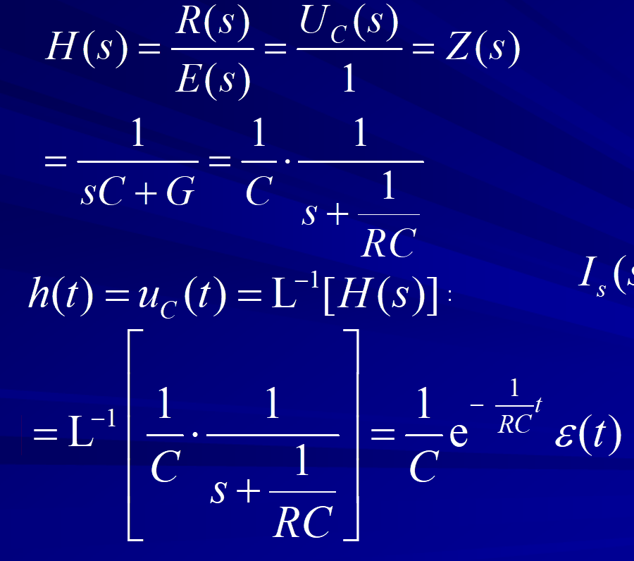
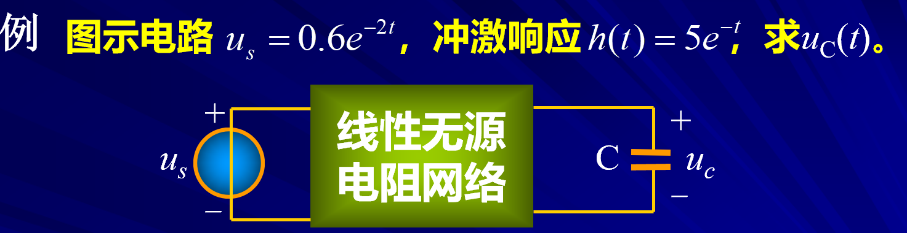
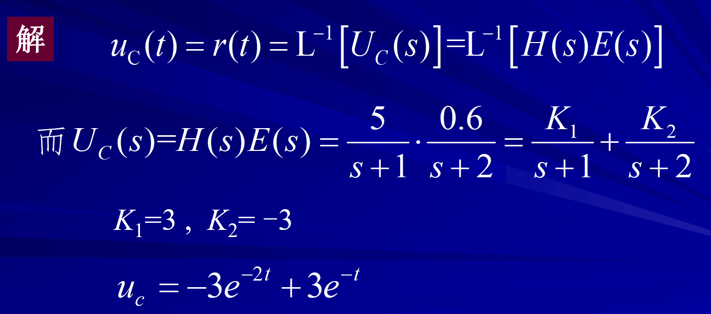

# 网络函数

<!-- @import "[TOC]" {cmd="toc" depthFrom=1 depthTo=6 orderedList=false} -->

<!-- code_chunk_output -->

- [网络函数](#网络函数)
  - [1 网络函数的定义](#1-网络函数的定义)
  - [2 网络函数的应用](#2-网络函数的应用)
    - [2.1 求任意激励的零状态响应（已知网络函数）](#21-求任意激励的零状态响应已知网络函数)
      - [2.1.1 例题](#211-例题)
    - [2.2 网络函数加卷积定理求电路响应](#22-网络函数加卷积定理求电路响应)
      - [2.2.1 例题](#221-例题)

<!-- /code_chunk_output -->

---

网络函数相对于之前的*Laplace*比较独立。
但是网络函数是定义在复频域$s$下的。

## 1 网络函数的定义  

线性线性时不变网络在单一电源激励下，其零状态响应的像函数与激励的像函数之比定义为该电路的网络函数$H(s)$。

$$H(s)\xlongequal{def}\frac{R(s)}{E(s)}$$

激励（Excitation）：电压源或者电流源或者复合电源，单一激励要么是$u_s(t)$或者$i_s(t)$。
响应（Response）：激励在电路中各部分引起的电压和电流的输出。
零状态：动态电路（储能元件）的初始值为0（不储能）。
$$H(s) \xlongequal{def} \frac{\mathscr{L}[零状态响应]}{\mathscr{L}[激励函数]} = \frac{\mathscr{L}[r(t)]}{\mathscr{L}[e(t)]}=\frac{R(s)}{E(s)}$$

1. 根据激励和响应的不同表示不同的物理含义：例如电压&电流转移函数，驱动点阻抗，转移阻抗。[^不同的物理含义]
2. $ e(t) = 1\Rightarrow E(s) = 1\Rightarrow R(s) = H(s)$这种特殊的响应称为冲击响应，因为激励是一个冲击函数。

## 2 网络函数的应用

### 2.1 求任意激励的零状态响应（已知网络函数）  

$$R(s) = H(s)E(s)$$
$R(s)$为零状态响应的象函数,所以可以求得$r(t)$

#### 2.1.1 例题  

- 步骤  
  1. 画出运算电路
  2. 使用网络函数，并解读网络函数的含义写成物理含义。
  3. 逆变换求解原函数

**根据以上步骤不难发现网络函数$H(S)$往往是已知的，然后借助已知的网路函数求出响应和激励的象函数关系，最后再逆变换求零状态的响应和激励。**

### 2.2 网络函数加卷积定理求电路响应

 证明 

$$R(s)=H(s)E(s)$$
$$r(t)=\mathscr{L}^{-1}\left[E(s)H(s)\right]=e(t)*h(t)$$
卷积[^*的解释]

$$r(t)=\int_0^te(t-\xi)h(\xi)\mathrm{d}\xi=\int_0^te(\xi)h(t-\xi)\mathrm{d}\xi $$

我们既可以直接使用象函数乘积再逆变换或者直接使用卷积积分求解

- 解题方法
  - 复频域象函数+逆变换
  - 时域卷积积分
#### 2.2.1 例题 

<!-- /code_chunk_output -->

[^不同的物理含义]:由于激励E(s)可以是电压源或电流源，响应R(s)可以是电压或电流，故 s 域网络函数可以是驱动点阻抗（导纳），转移阻抗（导纳），电压转移函数或电流转移函数。
[^*的解释]: `*` 表示卷积：$$(f*g)(n)=\int_{-\infty}^{\infty}f(\tau)g(n-\tau)d\tau $$