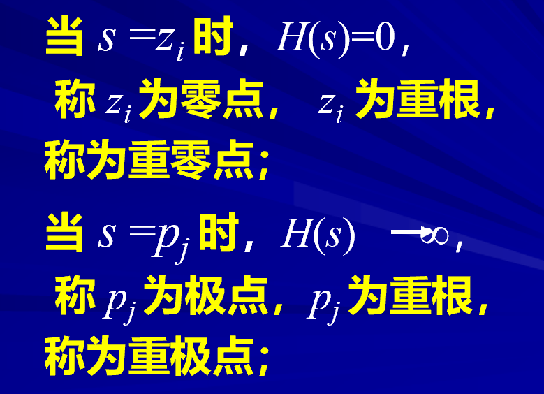
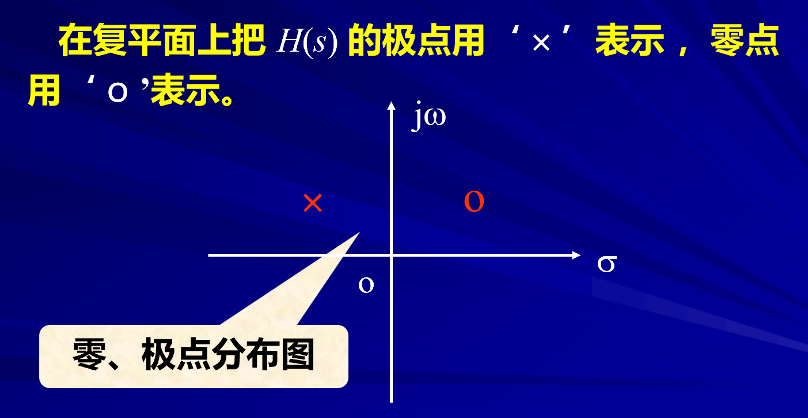
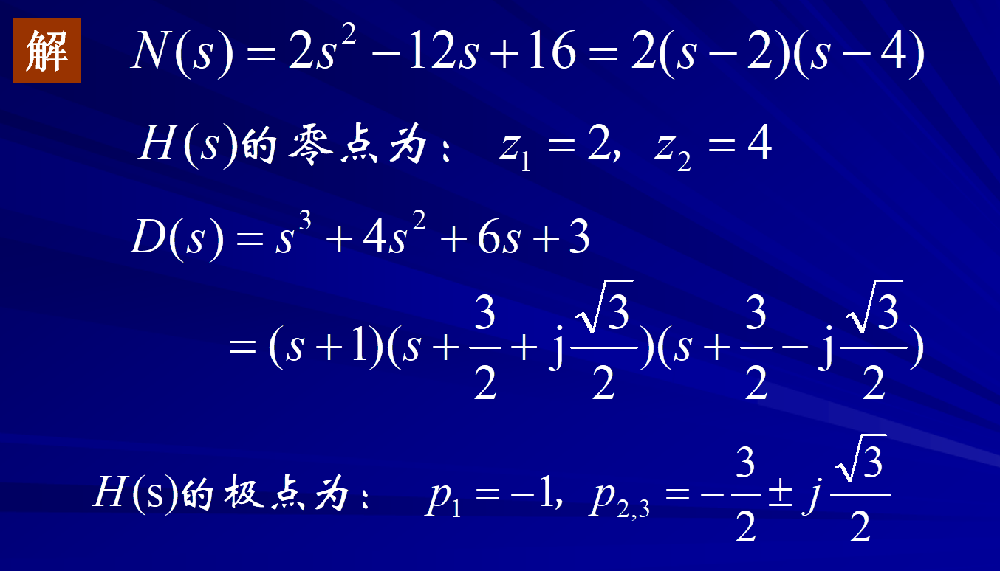
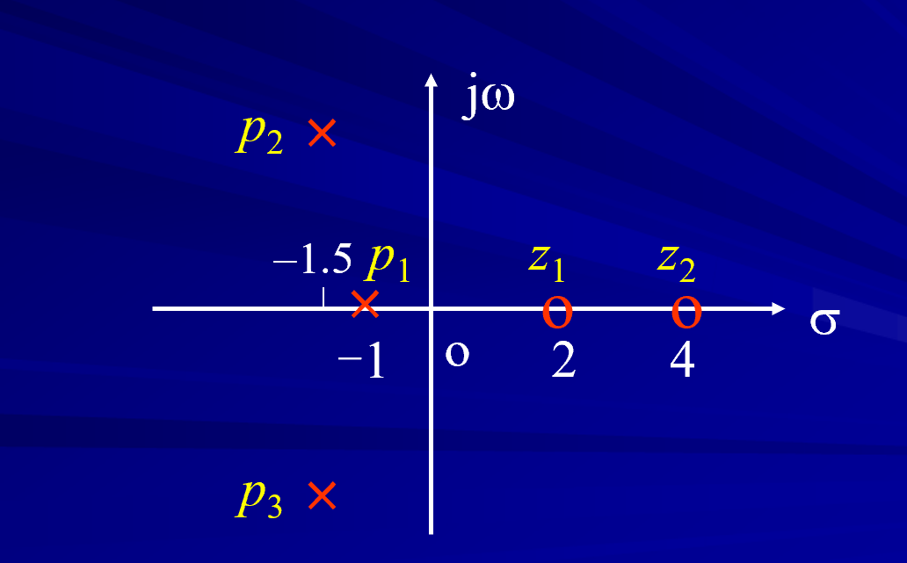

# 网络函数的极点和零点

<!-- @import "[TOC]" {cmd="toc" depthFrom=1 depthTo=6 orderedList=false} -->

<!-- code_chunk_output -->

- [网络函数的极点和零点](#网络函数的极点和零点)
  - [1 极点和零点](#1-极点和零点)
  - [2 复平面](#2-复平面)
    - [2.1 例题](#21-例题)

<!-- /code_chunk_output -->

---

我们时常需要讨论电路在不同频率下的性质
高通和低通。这似乎与网络函数的极值有关系。

## 1 极点和零点

$$H(s)=\frac{N(s)}{D(s)}=\frac{H_0(s-z_1)(s-z_2)\cdots(s-z_m)}{(s-p_1)(s-p_2)\cdots(s-p_n)}$$
$$=H_0 \frac{\prod_{i=1}^n\left(s-z_i\right)}{\prod_{j=1}^n\left(s-p_j\right)}$$

定义零点和极点

这些零点可能是单根，重根或者共轭复根等等。 

## 2 复平面 

上述求出来的那些根可以在复平面上表示。

### 2.1 例题

如果我们已经求得了一个网络函数的表达式：

零点使用字母z：zero
极点使用字母p：pole  

