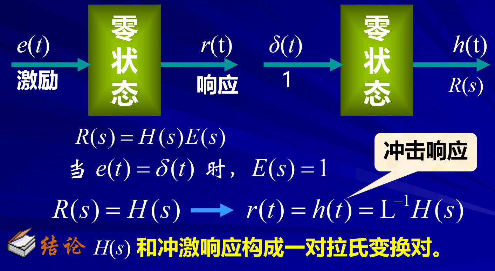
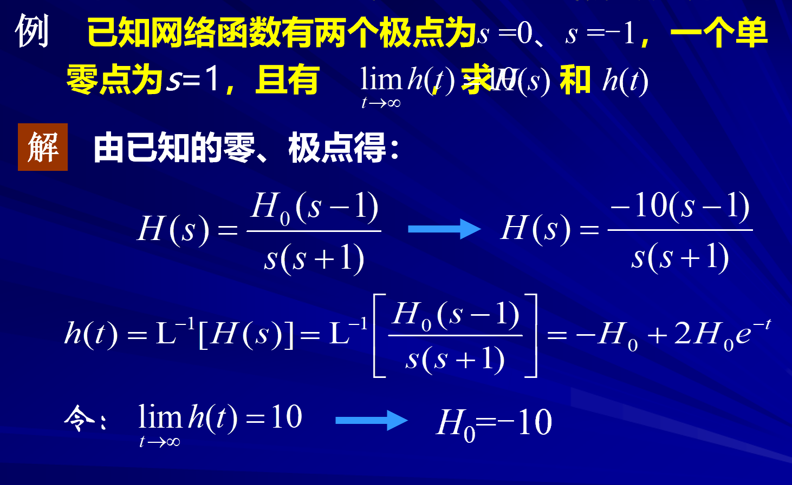
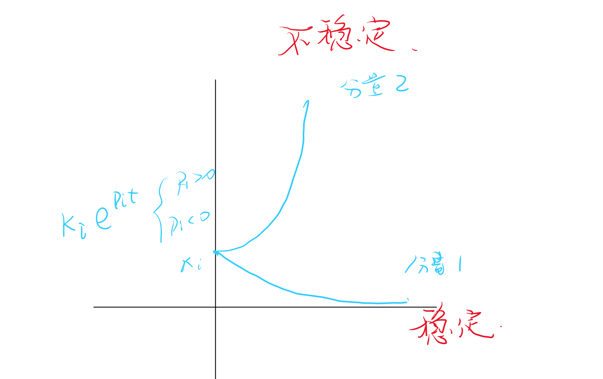
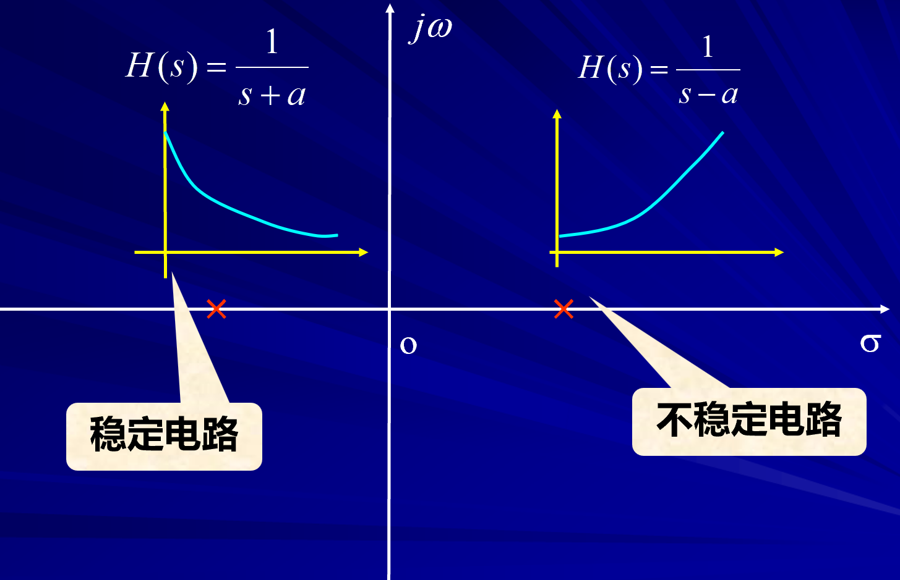
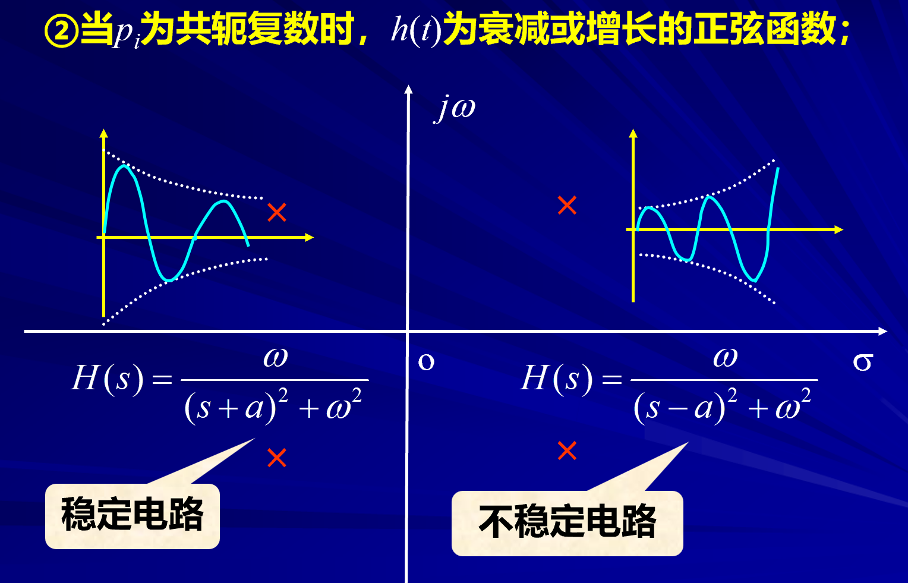
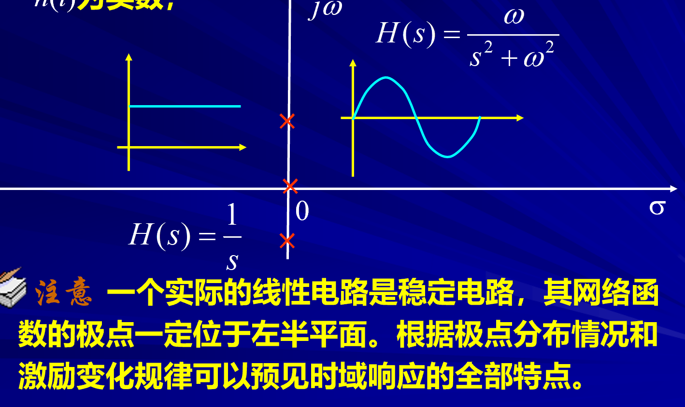

# 网络函数的极点，零点，冲击与响应

<!-- @import "[TOC]" {cmd="toc" depthFrom=1 depthTo=6 orderedList=false} -->

<!-- code_chunk_output -->

- [网络函数的极点，零点，冲击与响应](#网络函数的极点零点冲击与响应)
  - [1 网络函数与冲击响应](#1-网络函数与冲击响应)
    - [1.1 例题](#11-例题)
  - [2 极点、零点与冲激响应](#2-极点-零点与冲激响应)

<!-- /code_chunk_output -->

---

## 1 网络函数与冲击响应 

**电路的激励是一个冲击函数**

$$e(t)=\delta(t)\Rightarrow E(s) = \mathscr{L}[\delta(t)] = 1 $$

$$H(s) = \frac{R(s)}{E(s)}=R(s)$$

$$r(t) =\mathscr{L}^{-1}[H(s)] $$

$$r(t) = \mathscr{L}^{-1}[R(s)] =\mathscr{L}^{-1}[H(s)] $$

### 1.1 例题  

## 2 极点、零点与冲激响应

**首先网络函数为真分式，并且极点为单根**

$$r(t) = h(t)$$

$$r(t) = h(t)=\mathscr{L}^{-1}[H(\mathbf{s})]=\mathscr{L}^{-1}[\sum_{i=1}^n\frac{K_i}{s-p_i}]=\sum_{i=1}^nK_ie^{p_it}$$

因此最终冲激响应的结果是一个指数函数的叠加。  

每一项都是响应的分量，

$p_i$为复实根

- 正弦函数
   - $\mathscr{L}[\sin{(\omega t)}]=\mathscr{L}[\frac{e^{j\omega t}-e^{-j\omega t}}{2j}]=\frac{\omega}{s^2+\omega^{2}}$
- 余弦函数
   - $\mathscr{L}[\cos(\omega t)] = \frac{s}{s^2+\omega^2}$

- 延迟性质
    - $$\begin{cases}
        \text{若：}\mathscr{L}[f(t)]=F(s)\\
        \text{则：}\mathscr{L}[f(t-t_0)\varepsilon(t-t_0)]=e^{-st_0}F(s)
    \end{cases}$$

**因此我们可以通过极点的位置来判断电路的稳定性**

