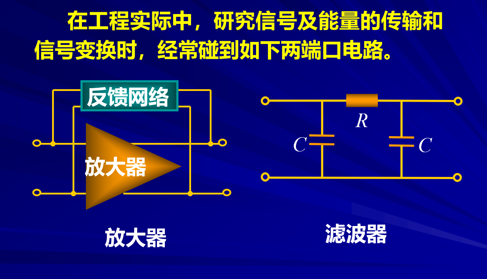
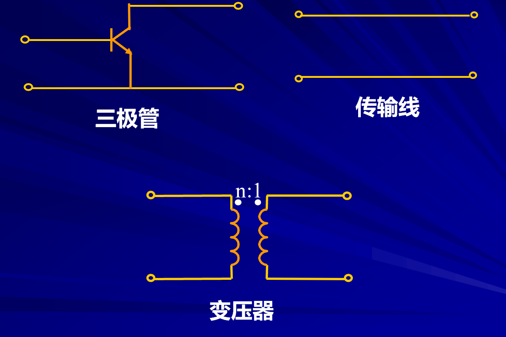
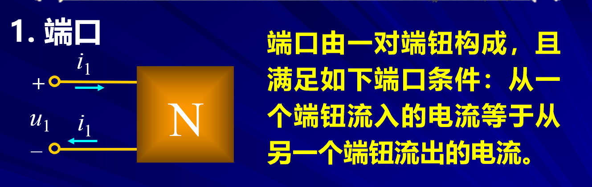
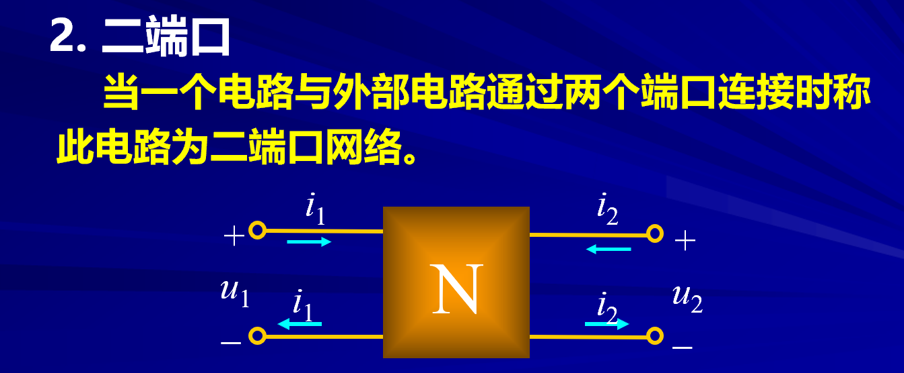
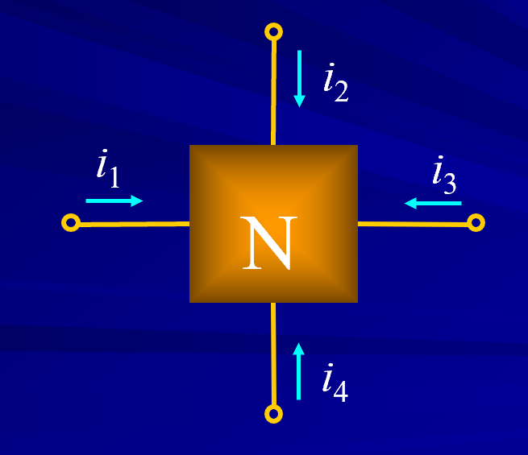
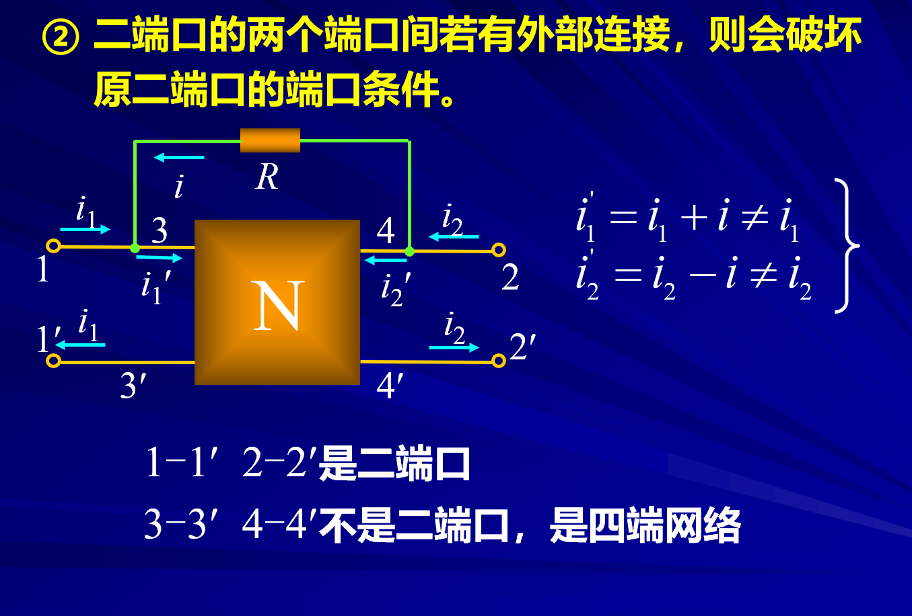
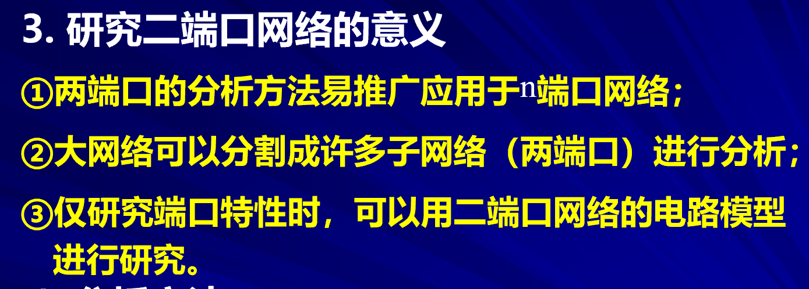
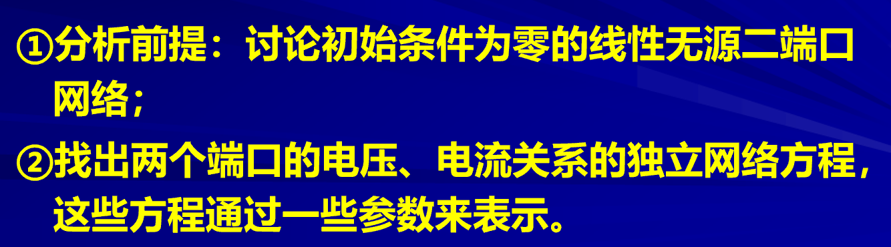

之前我们一直在一直电路结构的情况下进行计算，往往一直电流源，电阻电容等等，但是有的时候我们往往需要研究黑盒问题，也就是输入和输出的关系问题。
电路的“网络分析”法就是帮我们解决这类问题

# 二端口网络  

<!-- @import "[TOC]" {cmd="toc" depthFrom=1 depthTo=6 orderedList=false} -->

<!-- code_chunk_output -->

- [二端口网络](#二端口网络)
  - [0 预备知识](#0-预备知识)
  - [1 定义](#1-定义)
    - [1.1 端口的定义](#11-端口的定义)
    - [1.2 二端口定义](#12-二端口定义)
    - [1.3 四端网络](#13-四端网络)
    - [1.4 破坏端口的条件](#14-破坏端口的条件)
  - [2 二端口网络的意义](#2-二端口网络的意义)
  - [3 分析方法](#3-分析方法)

<!-- /code_chunk_output -->

---

## 0 预备知识

我们以放大器为例：许多电路都是有两个端口。

## 1 定义

### 1.1 端口的定义  

电流的连续性。

端口需要满足电流的连续性。

### 1.2 二端口定义  

二端口的两个端口分别需要自己满足端口定义。

### 1.3 四端网络 

### 1.4 破坏端口的条件  

## 2 二端口网络的意义  

## 3 分析方法  

*允许存在受控源，因为受控源无法提供能量。*

