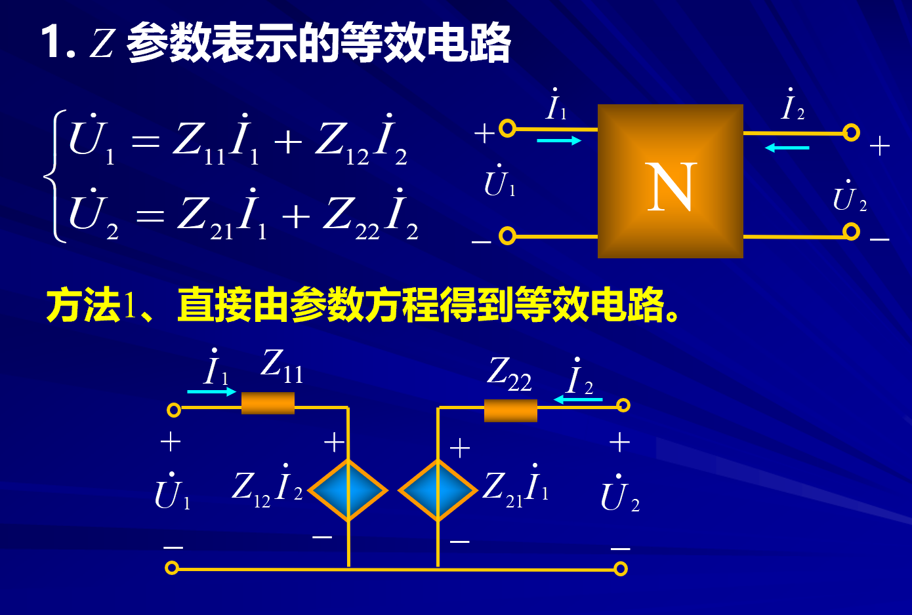
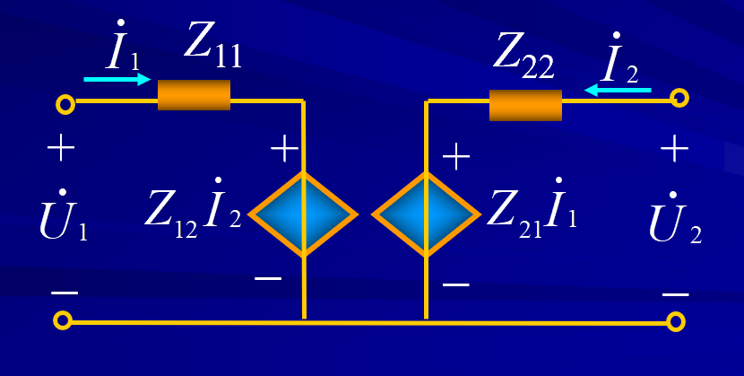
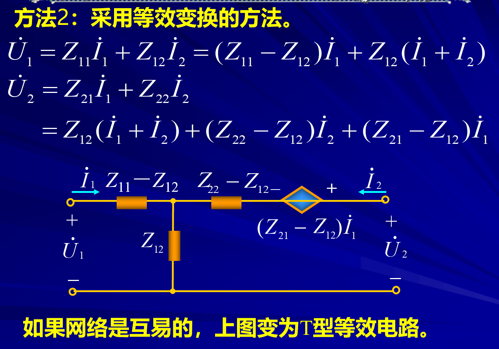
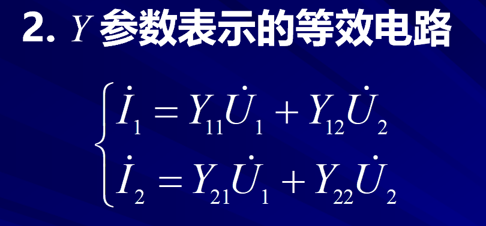
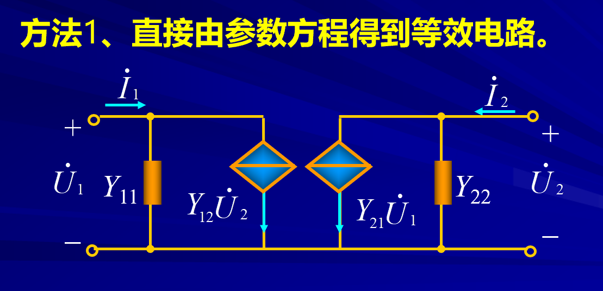
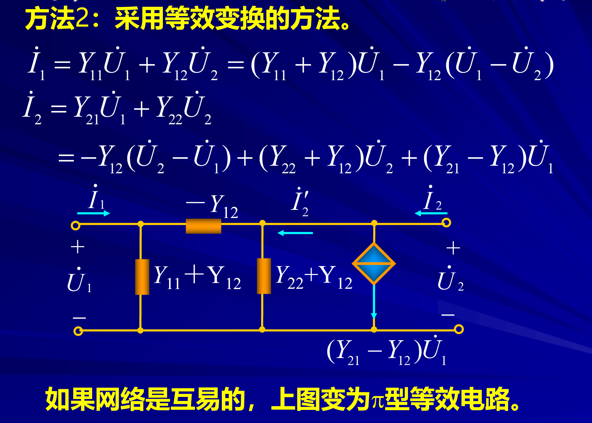
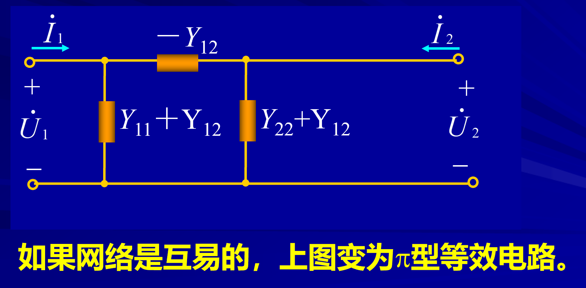
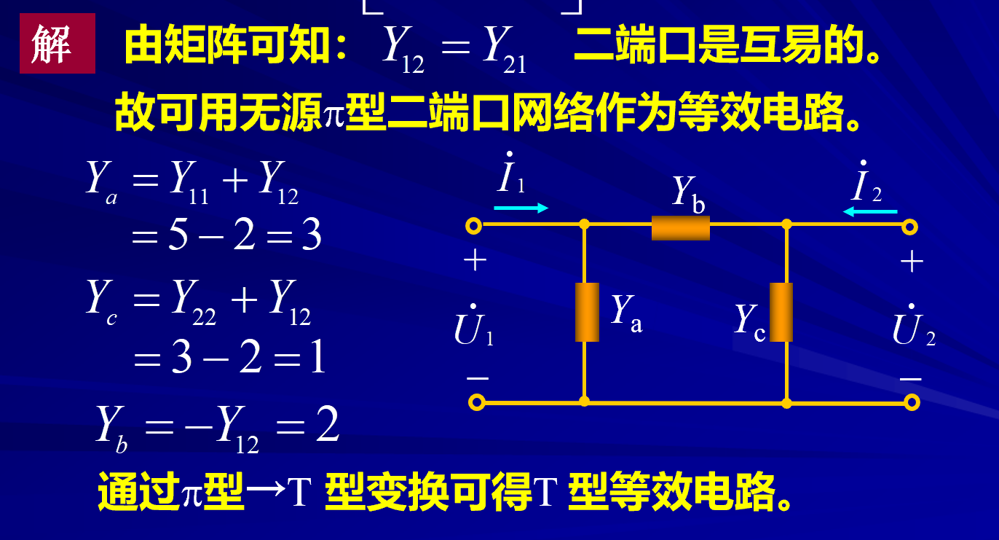

# 二端口等效电路 

<!-- @import "[TOC]" {cmd="toc" depthFrom=1 depthTo=6 orderedList=false} -->

<!-- code_chunk_output -->

- [二端口等效电路](#二端口等效电路)
  - [0 关于“等效”的一些说明](#0-关于等效的一些说明)
  - [1 Z参数表示的等效电路](#1-z参数表示的等效电路)
    - [1.1 Z参数直接等效](#11-z参数直接等效)
    - [1.2 Z参数等效变换（T型结构）](#12-z参数等效变换t型结构)
  - [2 Y参数表示的等效电路](#2-y参数表示的等效电路)
    - [2.1 Y参数直接等效](#21-y参数直接等效)
    - [2.2 Y参数等效变换（$\pi$型等效）](#22-y参数等效变换pi型等效)
    - [2.3 例题](#23-例题)

<!-- /code_chunk_output -->

---

一个无源二端口网络可以用一个简单的二端口等效模型来代替，要注意的是：
1. 等效条件：等效模型的方程与原二端口网络的方程相同
2. 根据不同的网络参数和方程可以得到结构完全不同的等效电路
3. 等效目的是为了分析方便

## 0 关于“等效”的一些说明  

- “等效”的物理实质：端口的参数方程相同。(等效都是对外而言。)
- 原二端口网络$\Leftrightarrow$简单二端口网络。
- “等效”的目的：简化电路分析

需要注意的是：**等效电路并不唯一**

## 1 Z参数表示的等效电路  

本来应该由很多参数，但是我们常用的只有两个参数的等效电路。

### 1.1 Z参数直接等效

### 1.2 Z参数等效变换（T型结构）   

互易：$Z_{12} = Z_{21}$

**注意受控源方向！**

## 2 Y参数表示的等效电路  

### 2.1 Y参数直接等效 

$U_2,U_1$不属于本端口的量可以适用受控源来表示。前面的电流也类似。

### 2.2 Y参数等效变换（$\pi$型等效）

互易：$Y_{21} = Y_{12}$

### 2.3 例题  

互易二端口。

**副对角线上的元素不相等则不互易。**
