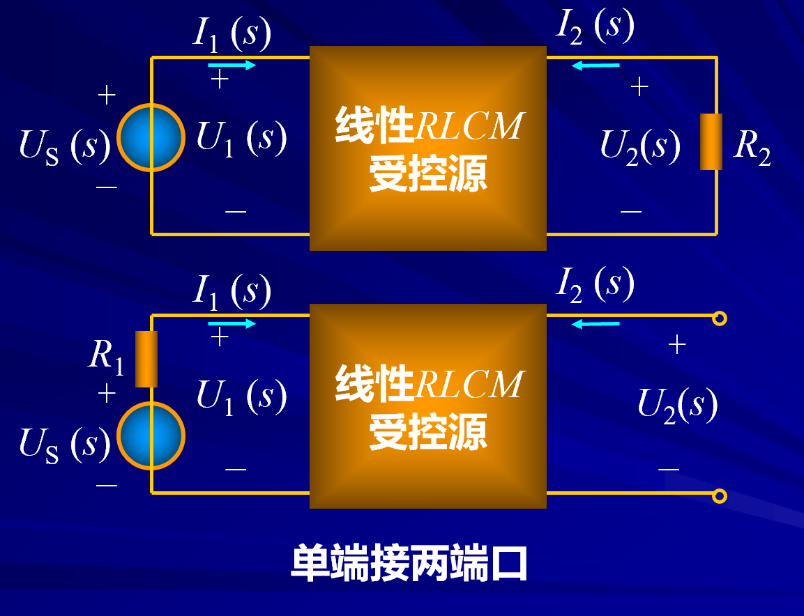

# 二端口的转移函数  
非考试重点

<!-- @import "[TOC]" {cmd="toc" depthFrom=1 depthTo=6 orderedList=false} -->

<!-- code_chunk_output -->

- [二端口的转移函数](#二端口的转移函数)
  - [1 无端接二端口的转移函数](#1-无端接二端口的转移函数)
    - [1.1 例题](#11-例题)
  - [2 有端接二端口的转移函数](#2-有端接二端口的转移函数)
    - [2.1 例题](#21-例题)

<!-- /code_chunk_output -->

---

**二端口常为完成某种功能起着耦合两部分电路的作用，这种功能往往是通过转移函数描述或指定的。因此，二端口的转移函数是一个很重要的概念 。**

Def：
二端口的转移函数（传递函数），就是用拉氏变换形式表示的输出电压或电流与输入电压或电流之比 。

## 1 无端接二端口的转移函数

==**无端接**：二端口没有外接负载及输入激励无内阻抗时的二端口称为无端接的二端口。==

### 1.1 例题  

开路认为不接负载$I_2(s) = 0$

短路认为不接负载$U_2(s) = 0$

## 2 有端接二端口的转移函数

==**有端接**：二端口的输出端口接有负载阻抗，输入端口接有电压源和阻抗的串联组合或电流源和阻抗的并联组合，称为有端接的二端口。==

**以下都单段接，还有双端接。**

### 2.1 例题  

step1：写出参数方程

step2：求解转移函数

