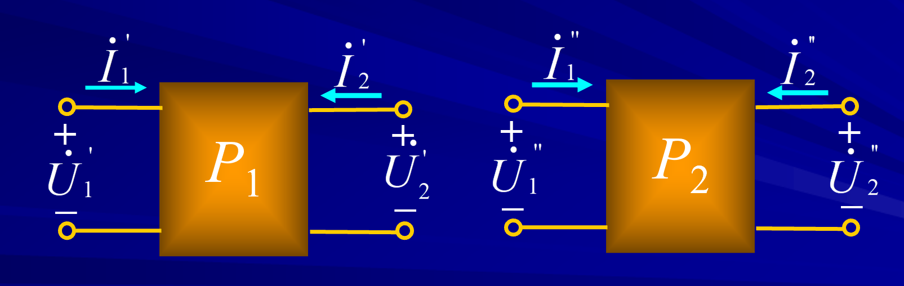

# 二端口的连接 

<!-- @import "[TOC]" {cmd="toc" depthFrom=1 depthTo=6 orderedList=false} -->

<!-- code_chunk_output -->

- [二端口的连接](#二端口的连接)
  - [1 级联(链联)](#1-级联链联)
    - [1.1 例题](#11-例题)
  - [2 并联](#2-并联)
  - [3 串联](#3-串联)

<!-- /code_chunk_output -->

---

一个复杂二端口网络可以看作是由若干简单的二端口按某种方式连接而成，这将使电路分析得到简化。

## 1 级联(链联)

Proof：

多个二端口依然可以推广。

### 1.1 例题  

hint：当然可以列方程求解。

## 2 并联

Proof：

Conclusion：

二端口并联所得复合二端口的Y 参数矩阵等于两个二端口Y 参数矩阵相加。

$$[Y] = \sum_{n=1}^{\infty}[Y^{n}]$$
**并联后端口条件可能被破坏。**

**我们只能研究整体的关系，不可拆分，因为端口条件可能被破坏。**

## 3 串联