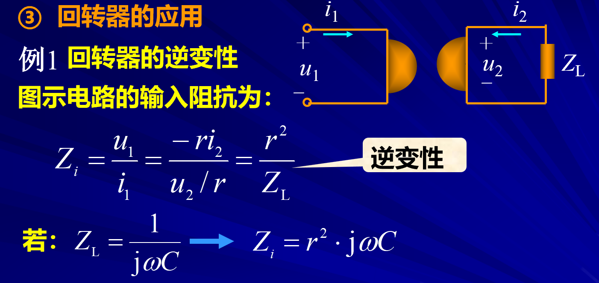

# 回转器和负阻抗转换器

<!-- @import "[TOC]" {cmd="toc" depthFrom=1 depthTo=6 orderedList=false} -->

<!-- code_chunk_output -->

- [回转器和负阻抗转换器](#回转器和负阻抗转换器)
  - [1 回转器](#1-回转器)
    - [1.1 参数和方程](#11-参数和方程)
      - [1.1.1 Z参数](#111-z参数)
      - [1.1.2 Y参数方程](#112-y参数方程)
      - [1.1.3 T参数方程](#113-t参数方程)
    - [1.2 功率](#12-功率)
    - [1.3 等效电路](#13-等效电路)
    - [1.4 回转器的应用](#14-回转器的应用)
      - [1.4.1 回转器的逆变性](#141-回转器的逆变性)
      - [1.4.2 回转器级联构成理想变压器](#142-回转器级联构成理想变压器)
  - [2 负阻抗转换器](#2-负阻抗转换器)
    - [2.1 参数和方程](#21-参数和方程)
    - [2.2 应用](#22-应用)
      - [2.2.1 正阻抗变成负阻抗](#221-正阻抗变成负阻抗)
        - [2.2.1.1 例题](#2211-例题)

<!-- /code_chunk_output -->

---

## 1 回转器

回转器是一种线性的，非互易（正着用和反着用一样称为互易元件）的多端元件，可以哟个晶体管，运算放大器来实现。

回转电阻就是一个系数，但是由于量纲的统一性所以用`r`但是又要和`R`（电阻）做区分

我们用参数方程尝试描述这个特殊的二端口

### 1.1 参数和方程

#### 1.1.1 Z参数

#### 1.1.2 Y参数方程  

#### 1.1.3 T参数方程  

三个参数都是都是非互易，所以证明回转器是一个非互易的二端口，因此使用的时候需要特别注意方向。

### 1.2 功率

### 1.3 等效电路 

直译法等效。（直接翻译成电路）

（非重点）

### 1.4 回转器的应用  

#### 1.4.1 回转器的逆变性 

这里的`逆变性`体现在感性变成容性。

这在集成电路中显得十分有意义。

#### 1.4.2 回转器级联构成理想变压器  

## 2 负阻抗转换器  

负阻抗转换器（NIC）是一个能够把阻抗

**注意K的系数和电流的方向**

### 2.1 参数和方程 

### 2.2 应用  

#### 2.2.1 正阻抗变成负阻抗

(第二个公式推导似乎存在问题)

原本的阻抗的$Z_L$，接上复阻抗转换器之后变成$-\frac{Z_L}{k}$

##### 2.2.1.1 例题  

RC电路转换成RL电路 

