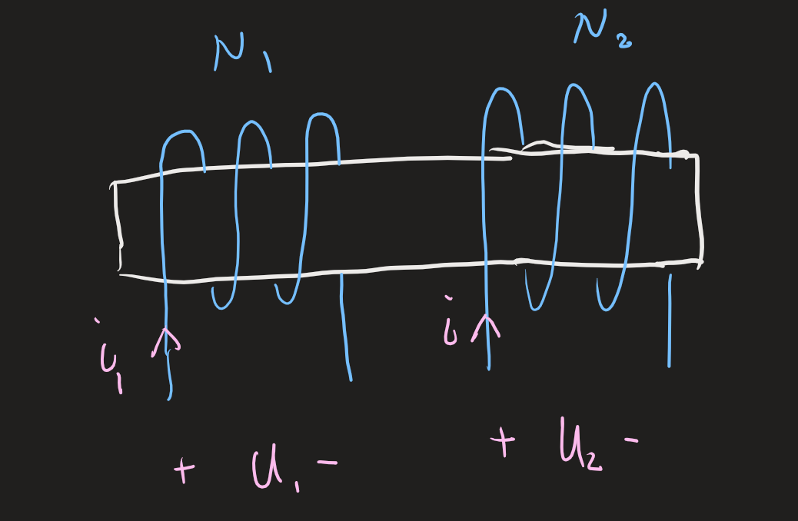

- 重点内容：
  - 互感和互感电压
  - 有互感电路的计算
  - 变压器和理想变压器的原理
  
  - 变压器的作用
    - 改变电压
    - 改变电流
    - 阻抗匹配
  

# 互感  
解释：两个或者两个的电感在电路中相互影响。载流线圈之间彼此相互联系的现象称为互感，即**磁耦合**。

**电感**：是一个线圈缠绕在铁芯上。**耦合电感**：

N_1线圈上通电可以在$N_2$线圈上检测出感应电动势，这种现象称为互感
定义：**磁链**$\Psi=N\phi$，磁链是磁通的总和

- 自感磁通链$\Psi=L_1i_1$（L称为自感系数）
- 互感磁通链$\Psi=M_1i_1$（M称为互感系数）
当我们有两个线圈的时候，磁链应该是代数和
**耦合电感中的磁通链是自感磁通链和互感磁通链的代数和**。
$$\begin{aligned}\Psi_{1}&=\Psi_{n}\pm\Psi_{12}=L_1i_{1}\pm Mi_{2}\\\Psi_{2}&=\pm\Psi_{21}+\Psi_{22}=\pm Mi_{1}+L_{2}i_{2}\end{aligned}$$
对于每一个每一个线圈，我们都要计算他的互感磁通链和自感磁通链。然后每一个线圈的磁通链等于自感和互感的代数和。其中**同向相加，异向相减**

- 耦合疏密程度:$\frac{|\Psi_{12}|}{\Psi_{11}} = \frac{Mi_2}{L_1i_1}$
- 耦合因数:$k \overset{\text{def}}{=} \frac{M}{\sqrt{L_1L_2}}$
