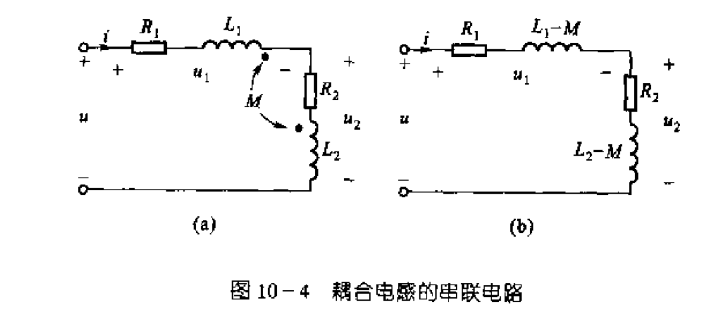
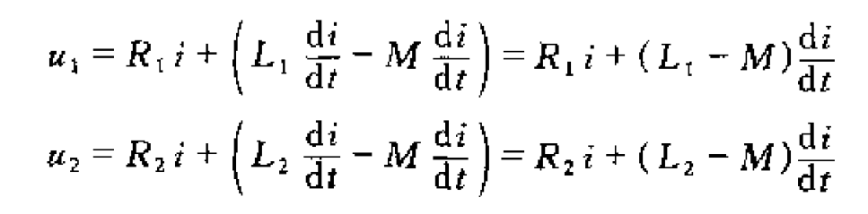
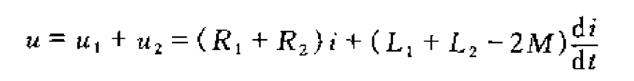
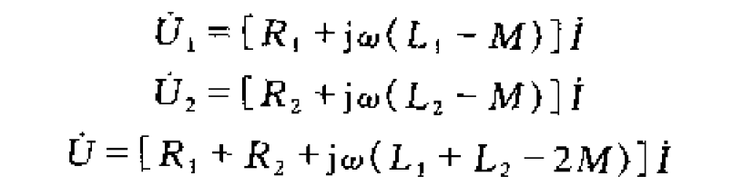
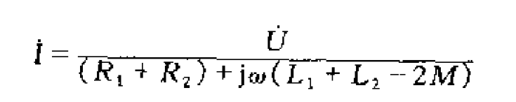
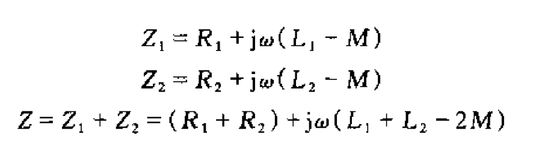
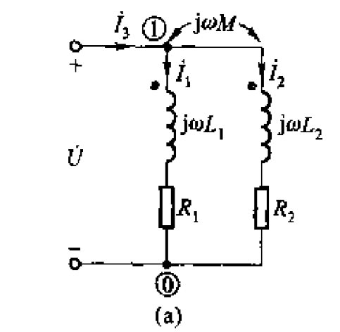
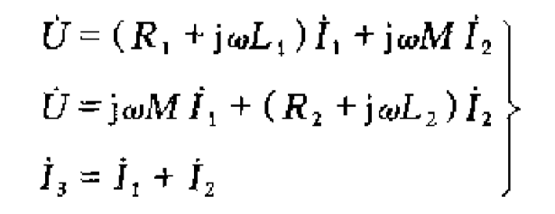
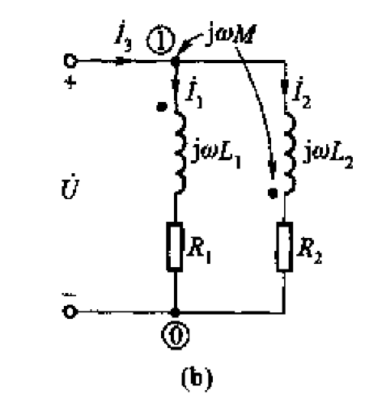
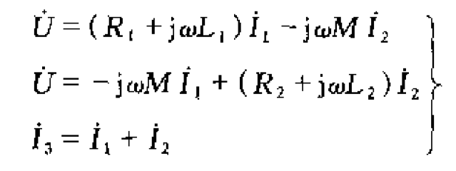

# 10.2耦合电感的电路计算

**所谓等效就是具有完全相同的伏安特性**

## 耦合电感常见的组合方式

- [耦合电感串联](#耦合电感的串联)
  - [反接串联](#反接串联)
  - [顺接串联](#顺接串联)

    - **等效电路**
      - 等效电阻（$R=R_1+R_2$）
      - 等效电感（$L=L_1+L_2+2M$）
      - 等效阻抗（$Z=Z_1+Z_2=(R_1+R_2)+j\omega(L_1+L_2+2M)$）

- 耦合电感并联
  - 同侧并联
  - 反侧并联
- 其他情况
可以用于电路的简化（类比电阻的等效）

---

## 耦合电感的串联

### 反接串联

线圈含有阻值所以电路需要变为电阻和线圈串联
同名端都进电流则称为顺接，反则为反接

#### 直流电路中

#### 正弦电路中

所以等效情况为

- <mark>**等效电路**</mark>
  - <mark>等效电阻（$R=R_1 +R_2$)两个线圈的电阻代数和
  - <mark>等效电感（$L=L_1+L_2-2M$）
  - <mark>等效阻抗（$Z=Z_1+Z_2=(R_1+R_2)+j\omega(L_1+L_2-2M)$）

### 顺接串联

- **等效电路**
  - 等效电阻（$R=R_1+R_2$）
  - 等效电感（$L=L_1+L_2+2M$）
  - 等效阻抗（$Z=Z_1+Z_2=(R_1+R_2)+j\omega(L_1+L_2+2M)$）

### 互感系数的测量方法

根据刚刚的分析我们得到了互感系数的测量方法
$$M= \frac{L_{顺接}-L_{反接}}{4}$$

#### 全耦合时候

$k=\frac{M}{\sqrt{L_1L_2}}$当K=1的时候我们认为时全耦合

$M=\sqrt{L_1L_2}$

## 耦合电路的并联

### 同侧并联

对于同侧并联，正弦稳态电路我们可以列出方程

- 等效电路
  - 等效电感$$L_E=\frac{L_1L_2-M^2}{L_1+L_2-2M} $$

最终我们联立求解得到了

#### 全耦合状态
$k=1，M^2=L_1L_2$
- $L_1=L_2$
  - $L_E=0$
- $L1\leq L_2$

### 反侧并联

- 等效电路
  - 等效电感 $$L_{eq}=\frac{L_1L_2-M^2}{L_1+L_2+2M}$$

## 耦合电路的去耦等效

### 同侧并联去耦等效

### 异侧

整体结构
# 课程

- 串并联等效
  - 耦合电感串联
    - 顺接
    - 等效电路
      - 直流
      - 正弦
    - 反接
  - 耦合电感并联
    - 同侧
    - 反侧
- 去耦等效
  - 并联去耦
    - 同侧
    - 反侧
- 互感系数的测量
